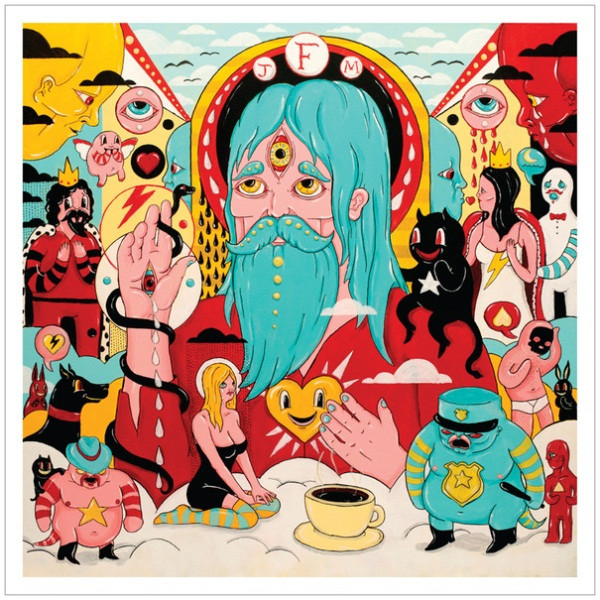

# Fear Fun

By Father John Misty

## Album Data

[Discogs URL](https://www.discogs.com/release/3582159-Father-John-Misty-Fear-Fun)

- Label: Sub Pop
- Formats: Vinyl, LP, Album
- Genres: Rock, Folk Rock, Country Rock, Indie Rock, Pop Rock
- Rating: 4.36
- Released: 2012-05-01
- Year: 2012
- Release ID: 3582159
- Media condition: 
- Sleeve condition: 
- Speed: 
- Weight: 
- Notes: 

## Album Tracks

| **Position** | **Title** | **Duration** |
|--------------|-----------|--------------|
| A1 | **Funtimes In Babylon** |  |
| A2 | **Nancy From Now On** |  |
| A3 | **Hollywood Forever Cemetery Sings** |  |
| A4 | **I'm Writing A Novel** |  |
| A5 | **O I Long To Feel Your Arms Around Me** |  |
| A6 | **Misty's Nightmares 1 & 2** |  |
| B1 | **Only Son Of The Ladiesman** |  |
| B2 | **This Is Sally Hatchet** |  |
| B3 | **Well, You Can Do It Without Me** |  |
| B4 | **Now I'm Learning To Love The War** |  |
| B5 | **Tee Pees 1-12** |  |
| B6 | **Everyman Needs A Companion** |  |

## Artist Roles

| **Name** | **Role** |
|----------|----------|
| **Jeff Kleinsmith** | Design |
| **Sasha Barr** | Design |
| **Hugo Nicolson** | Engineer |
| **Jonathan Wilson** | Engineer |
| **Wylie Gelber** | Engineer [Assistant] |
| **Greg Calbi** | Mastered By |
| **Ray Janos** | Mastered By [Vinyl] |
| **Phil Ek** | Mixed By |
| **Dimitri Drjuchin** | Painting [Cover], Artwork [Interior] |
| **Emma Garr** | Photography By [Insert] |
| **J. Tillman** | Producer |
| **Jonathan Wilson** | Producer |
| **J. Tillman** | Written-By [All Songs By] |

