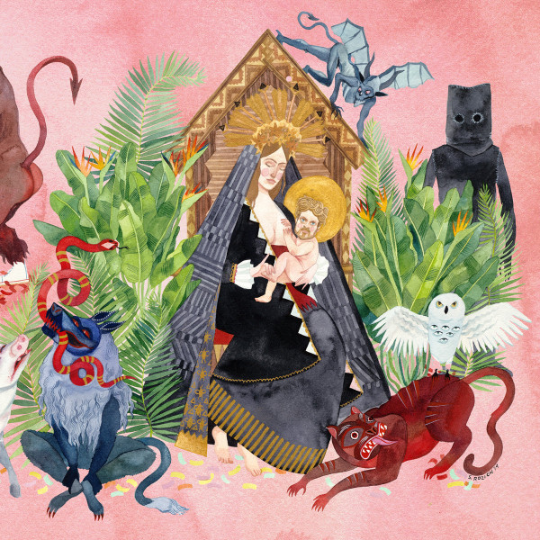

# I Love You, Honeybear

By Father John Misty

## Album Data

[Discogs URL](https://www.discogs.com/release/6636294-Father-John-Misty-I-Love-You-Honeybear)

- Label: Sub Pop
- Formats: Vinyl, 12", 45 RPM, Album
- Genres: Folk, World, & Country
- Rating: 4.49
- Released: 2015-02-10
- Year: 2015
- Release ID: 6636294
- Media condition: 
- Sleeve condition: 
- Speed: 
- Weight: 
- Notes: 

## Album Tracks

| **Position** | **Title** | **Duration** |
|--------------|-----------|--------------|
| A1 | **I Love You, Honeybear** |  |
| A2 | **Chateau Lobby #4 (In C For Two Virgins)** |  |
| A3 | **True Affection** |  |
| B1 | **The Night Josh Tillman Came To Our Apt.** |  |
| B2 | **When You're Smiling And Astride Me** |  |
| B3 | **Nothing Good Ever Happens At The Goddamn Thirsty Crow** |  |
| C1 | **Strange Encounter** |  |
| C2 | **The Ideal Husband** |  |
| C3 | **Bored In The USA** |  |
| D1 | **Holy Shit** |  |
| D2 | **I Went To The Store One Day** |  |

## Artist Roles

| **Name** | **Role** |
|----------|----------|
| **J. Tillman** | Art Direction |
| **Sasha Barr** | Art Direction |
| **Alia Penner** | Artwork [Inside] |
| **Bryce Gonzales** | Engineer |
| **Ryan Smith (2)** | Lacquer Cut By |
| **Greg Calbi** | Mastered By |
| **Jonathan Wilson** | Mixed By |
| **Phil Ek** | Mixed By |
| **Stacey Rozich** | Painting |
| **Emma Elizabeth Tillman** | Photography By |
| **J. Tillman** | Producer |
| **Jonathan Wilson** | Producer |
| **Father John Misty** | Written-By |

