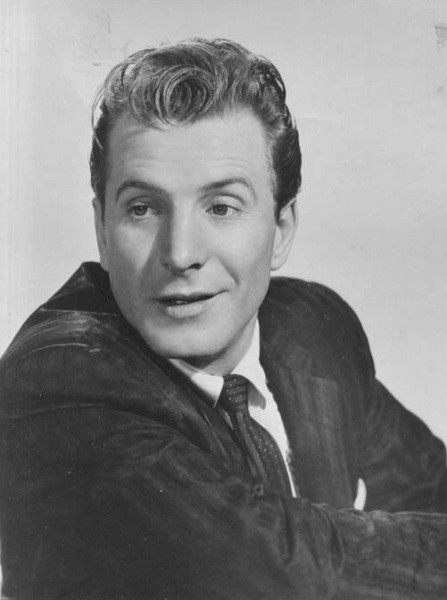

# Ferlin Husky

## Artist Profile

b. 3 December, 1925 (Cantwell, MO, USA) d. 17 March, 2011 (West Moreland, TN, USA). Inducted into the Country Music Hall of Fame (2010) and the Missouri Country Music Hall of Fame (2006). Country singer and member of the Grand Ole Opry. 

## Artist Links

- [http://www.ferlinhusky.com/](http://www.ferlinhusky.com/)
- [http://www.cmt.com/artists/az/husky_ferlin/artist.jhtml](http://www.cmt.com/artists/az/husky_ferlin/artist.jhtml)
- [http://www.the9513.com/forgotten-artists-ferlin-husky/](http://www.the9513.com/forgotten-artists-ferlin-husky/)
- [http://www.hillbilly-music.com/](http://www.hillbilly-music.com/)
- [https://en.wikipedia.org/wiki/Ferlin_Husky](https://en.wikipedia.org/wiki/Ferlin_Husky)

## See also

- [Gone / Wings Of A Dove](Gone_-_Wings_Of_A_Dove.md)
