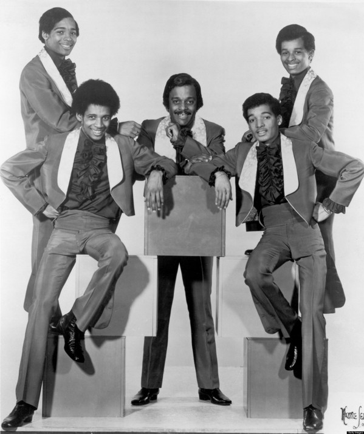

# Five Stairsteps

## Artist Profile

The Five Stairsteps, known as "The First Family of Soul", were an American Chicago soul group made up of five of Betty and Clarence Burke Sr.'s six children: Alohe Jean, Clarence Jr., James, Dennis, and Kenneth "Keni", and briefly, Cubie. They are best known for the 1970 song "O-o-h Child", listed #402 on Rolling Stone's 500 Greatest Songs of All Time. Later regrouped in the 1980s as Invisible Man's Band.

## Artist Links

- [http://en.wikipedia.org/wiki/Five_Stairsteps](http://en.wikipedia.org/wiki/Five_Stairsteps)
- [http://www.soulwalking.co.uk/Stairsteps.html](http://www.soulwalking.co.uk/Stairsteps.html)
- [http://www.whosampled.com/Five-Stairsteps/](http://www.whosampled.com/Five-Stairsteps/)
- [http://www.allmusic.com/artist/the-five-stairsteps-mn0000760977](http://www.allmusic.com/artist/the-five-stairsteps-mn0000760977)
- [https://www.imdb.com/name/nm2001439/](https://www.imdb.com/name/nm2001439/)

## See also

- [Ain't Gonna Rest (Till I Get You) / You Can't See](Aint_Gonna_Rest_Till_I_Get_You_-_You_Cant_See.md)
