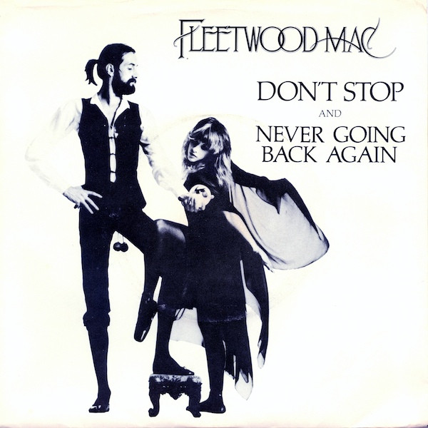

# Don't Stop / Never Going Back Again

By Fleetwood Mac

## Album Data

[Discogs URL](https://www.discogs.com/release/1579083-Fleetwood-Mac-Dont-Stop-Never-Going-Back-Again)

- Label: Warner Bros. Records
- Formats: Vinyl, 7", 45 RPM, Single, Stereo
- Genres: Rock, Pop, Pop Rock, Classic Rock, Vocal
- Rating: 4.36
- Released: 1977
- Year: 1977
- Release ID: 1579083
- Media condition: 
- Sleeve condition: 
- Speed: 
- Weight: 
- Notes: 

## Album Tracks

| **Position** | **Title** | **Duration** |
|--------------|-----------|--------------|
| A | **Don't Stop** | 3:11 |
| B | **Never Going Back Again** | 2:14 |

## Artist Roles

| **Name** | **Role** |
|----------|----------|
| **Chris Morris (2)** | Engineer [Assisted By] |
| **Ken Perry** | Lacquer Cut By |
| **Fleetwood Mac** | Producer |
| **Ken Caillat** | Producer, Engineer |
| **Richard Dashut** | Producer, Engineer |

