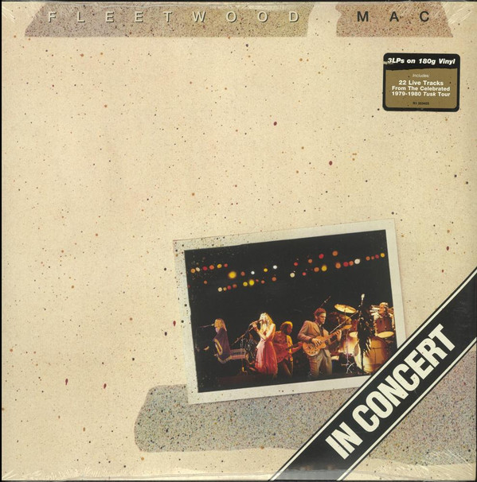

# In Concert

By Fleetwood Mac

## Album Data

[Discogs URL](https://www.discogs.com/release/8205362-Fleetwood-Mac-In-Concert)

- Label: Warner Bros. Records
- Formats: Vinyl, LP, Album
- Genres: Rock, Pop
- Rating: 4.34
- Released: 2016-03-04
- Year: 2016
- Release ID: 8205362
- Media condition: 
- Sleeve condition: 
- Speed: 
- Weight: 
- Notes: 

## Album Tracks

| **Position** | **Title** | **Duration** |
|--------------|-----------|--------------|
| A1 | **Intro (Wembley, 6/26/80)** |  |
| A2 | **Say You Love Me (Wembley, 6/26/80)** |  |
| A3 | **The Chain (Wembley, 6/20/80)** |  |
| A4 | **Don't Stop (Wembley, 6/27/80)** |  |
| A5 | **Dreams (Wembley, 6/20/80)** |  |
| B1 | **Oh Well (Wembley, 6/20/80)** |  |
| B2 | **Rhiannon (Tucson, 8/28/80)** |  |
| B3 | **Over & Over (St. Louis, 11/5/79)** |  |
| B4 | **That's Enough For Me (Wembley, 6/21/80)** |  |
| C1 | **Sara (Tucson, 8/28/80)** |  |
| C2 | **Not That Funny (St. Louis, 11/5/79)** |  |
| C3 | **Tusk (St. Louis, 11/5/79)** |  |
| C4 | **Save Me A Place (St. Louis, 11/5/79)** |  |
| D1 | **Landslide (Omaha, 8/21/80)** |  |
| D2 | **What Makes You Think You're The One (St. Louis, 11/5/79)** |  |
| D3 | **Angel (St. Louis, 11/5/79)** |  |
| D4 | **You Make Loving Fun (Wembley, 6/20/80)** |  |
| E1 | **I'm So Afraid (St. Louis, 11/5/79)** |  |
| E2 | **World Turning (Wembley, 6/22/80)** |  |
| F1 | **Go Your Own Way (Wembley, 6/22/80)** |  |
| F2 | **Sisters Of The Moon (Wembley, 6/22/80)** |  |
| F3 | **Songbird (Wembley, 6/27/80)** |  |

