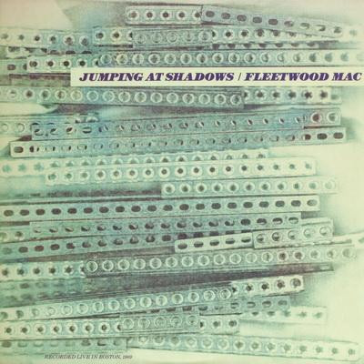

# Jumping At Shadows

By Fleetwood Mac

## Album Data

[Discogs URL](https://www.discogs.com/release/2278515-Fleetwood-Mac-Jumping-At-Shadows)

- Label: Varrick Records
- Formats: Vinyl, LP, Album
- Genres: Rock, Blues Rock
- Rating: 4.47
- Released: 1985
- Year: 1984
- Release ID: 2278515
- Media condition: 
- Sleeve condition: 
- Speed: 
- Weight: 
- Notes: 

## Album Tracks

| **Position** | **Title** | **Duration** |
|--------------|-----------|--------------|
| A1 | **Oh, Well** | 3:32 |
| A2 | **Like It This Way** | 4:33 |
| A3 | **World In Harmony** | 3:42 |
| A4 | **Only You** | 4:23 |
| B1 | **Black Magic Woman** | 6:30 |
| B2 | **Jumping At Shadows** | 4:58 |
| B3 | **Can't Hold On** | 6:58 |

## Artist Roles

| **Name** | **Role** |
|----------|----------|
| **John McVie** | Bass |
| **Helen Robinson (5)** | Cover, Design |
| **Mick Fleetwood** | Drums |
| **Danny Kirwan** | Guitar, Vocals |
| **Jeremy Spencer** | Guitar, Vocals |
| **Peter Green (2)** | Guitar, Vocals |
| **Frank Ford (11)** | Lacquer Cut By |
| **Vic Maile** | Recorded By |

