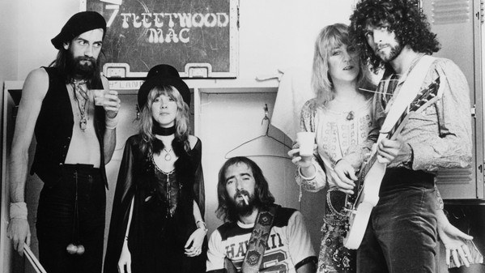

# Fleetwood Mac

## Artist Profile

Founded in London in July 1967 (by ex-Bluesbreakers members, Peter Green and Mick Fleetwood), "Peter Green's Fleetwood Mac" instantly became a major force in the UK blues scene, along with their eponymous first album. Following "Mr. Wonderful" & "Then Play On" the driving force of Peter Green had deteriorated as he lapsed into a personal crisis by 1970. The group reorganized, under the leadership of Fleetwood, and slowly took on a new direction - away from the blues and into the mainstream of international popularity, known simply as Fleetwood Mac.

Member/Dates:
Peter Green (guitar, vocals, 1967-70)
Mick Fleetwood (drums, 1967-1995, 1997-present)
John McVie (bass, 1967-1995, 1997-present)
Jeremy Spencer (guitar, vocals, 1967-71)
Bob Brunning (bass, 1967)
Danny Kirwan (guitar, 1968-72)
Christine McVie (vocals, piano, accordion, 1970-1995, 1997-1998, 2014-present)
Bob Welch (guitar, vocals, 1971-74)
Bob Weston (guitar, 1973-74)
Dave Walker (guitar, vocals, 1973)
Doug Graves (keyboards, 1974)
Lindsey Buckingham (guitar, vocals, piano, 1975-87, 1993, 1997-2018)
Stevie Nicks (vocals, 1974–1991, 1993, 1997-present)
Billy Burnette (guitar, vocals, 1990-94)
Rick Vito (guitar, 1990-91)
Dave Mason, (guitar, vocals, 1993-94)
Bekka Bramlett (vocals, 1993-94)
Mike Campbell (lead guitar, vocals, 2018–present)
Neil Finn, (vocals, rhythm guitar, 2018–present)

Inducted into Rock And Roll Hall of Fame in 1998 (Performer)

## Artist Links

- [https://www.fleetwoodmac.com/](https://www.fleetwoodmac.com/)
- [https://en.wikipedia.org/wiki/Fleetwood_Mac](https://en.wikipedia.org/wiki/Fleetwood_Mac)
- [https://www.youtube.com/channel/UCAb60rVrvVQVfSgrX1UWb0g](https://www.youtube.com/channel/UCAb60rVrvVQVfSgrX1UWb0g)
- [https://www.youtube.com/channel/UCCzULu3prrEaPvM2ZtkJlYQ](https://www.youtube.com/channel/UCCzULu3prrEaPvM2ZtkJlYQ)
- [https://www.facebook.com/FleetwoodMac/](https://www.facebook.com/FleetwoodMac/)
- [https://twitter.com/fleetwoodmac](https://twitter.com/fleetwoodmac)
- [https://www.last.fm/music/Fleetwood+Mac](https://www.last.fm/music/Fleetwood+Mac)
- [https://myspace.com/fleetwoodmacworld](https://myspace.com/fleetwoodmacworld)

## See also

- [Don't Stop / Never Going Back Again](Dont_Stop_-_Never_Going_Back_Again.md)
- [In Concert](In_Concert.md)
- [Jumping At Shadows](Jumping_At_Shadows.md)
- [Rumours](Rumours.md)
