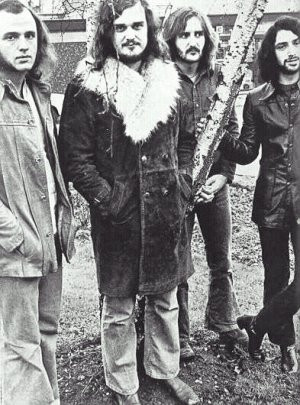

# Focus

## Artist Profile

Dutch rock group centered around flutist and vocalist Thijs Van Leer and guitarist Jan Akkerman in their original incarnation (1969-1976). The music is influenced by classical music, as heard in their signature song, the baroque style inspired "Hocus Pocus". The majority of their work is instrumental, like their biggest hit, "Sylvia". In the early 2000s, the band reformed with van Leer as the only member from previous line-ups; however he was soon joined by Pierre Van Der Linden on drums who had been a member in the 1970s. Since reforming, they have toured constantly and released four albums of new material, the latest being 2018's Focus (2) - Focus 11.

## Artist Links

- [https://focustheband.co.uk/](https://focustheband.co.uk/)
- [https://www.facebook.com/focustheband50](https://www.facebook.com/focustheband50)
- [http://www.progarchives.com/artist.asp?id=658](http://www.progarchives.com/artist.asp?id=658)
- [https://twitter.com/Focustheband](https://twitter.com/Focustheband)
- [https://en.wikipedia.org/wiki/Focus_%28band%29](https://en.wikipedia.org/wiki/Focus_%28band%29)
- [https://www.imdb.com/name/nm1549121/](https://www.imdb.com/name/nm1549121/)
- [https://www.youtube.com/channel/UCsJy-3kVxFKcDh83jbcJ-2Q](https://www.youtube.com/channel/UCsJy-3kVxFKcDh83jbcJ-2Q)

## See also

- [Hocus Pocus](Hocus_Pocus.md)
