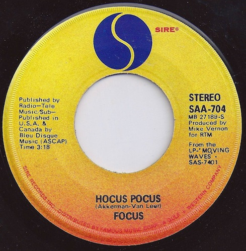

# Hocus Pocus

By Focus

## Album Data

[Discogs URL](https://www.discogs.com/release/1716655-Focus-Hocus-Pocus)

- Label: Sire
- Formats: Vinyl, 7", 45 RPM, Single
- Genres: Rock, Prog Rock
- Rating: 3.86
- Released: 1973
- Year: 1973
- Release ID: 1716655
- Media condition: 
- Sleeve condition: 
- Speed: 
- Weight: 
- Notes: 

## Album Tracks

| **Position** | **Title** | **Duration** |
|--------------|-----------|--------------|
| A | **Hocus Pocus** | 3:18 |
| AA | **Hocus Pocus II** | 3:25 |

## Artist Roles

| **Name** | **Role** |
|----------|----------|
| **Mike Vernon** | Producer |
| **Jan Akkerman** | Written-By |
| **Thijs Van Leer** | Written-By |

