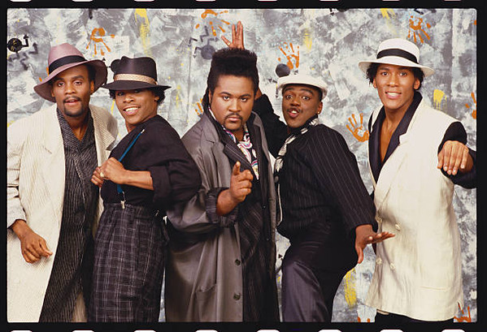

# Force MD's

## Artist Profile

R & B/Rap quintet formed in 1983, Staten Island, New York, USA. 
Discovered by Mr. Magic on the Staten Island Ferry Boat. Originally named The LD's, then later they renamed themselves Dr. Rock & The Force MC's before settling with Force MD's. 
Three of the group's original members passed away within five years of each other. Khalil rejoined the group in 1998. They were also joined by their nephew, Zieme Capers (Vocals) 

Current Members:
Rodney Lundy
Steven Lundy
Zieme Capers 

Past Members:
Jessie D
Mercury Nelson (died March 9, 1995)
DJ Dr. Rock (died 1996)
Antoine Lundy (died January 18, 1998)
Shawn Waters
Trisco Pearson (died September 16, 2016)
Damen Heyward
Jesse Daniels (died on January 4, 2022)

## Artist Links

- [https://en.wikipedia.org/wiki/Force_MDs](https://en.wikipedia.org/wiki/Force_MDs)
- [http://www.soulwalking.co.uk/Force%20MD's.html](http://www.soulwalking.co.uk/Force%20MD's.html)
- [https://www.allmusic.com/artist/force-mds-mn0000659295](https://www.allmusic.com/artist/force-mds-mn0000659295)
- [https://www.whosampled.com/Force-M.D.%27s/](https://www.whosampled.com/Force-M.D.%27s/)
- [https://www.facebook.com/ForceMds](https://www.facebook.com/ForceMds)

## See also

- [Forgive Me Girl](Forgive_Me_Girl.md)
