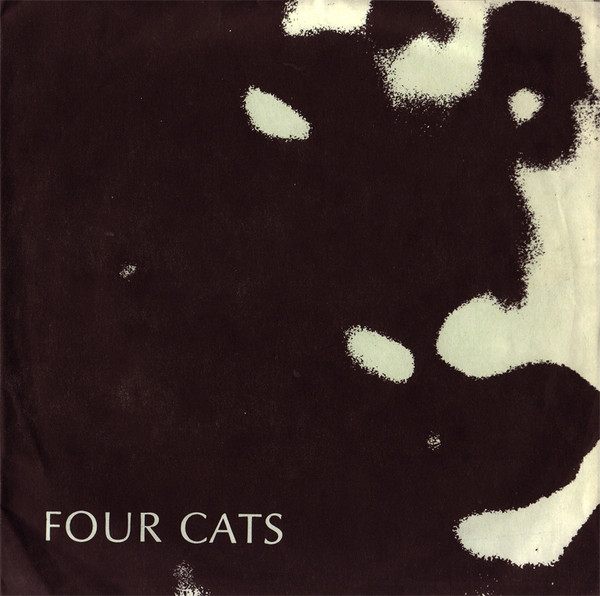

# Four Cats

By Four Cats

## Album Data

[Discogs URL](https://www.discogs.com/release/6883981-Four-Cats-Four-Cats)

- Label: Trend Pig
- Formats: Vinyl, 7", 45 RPM, EP
- Genres: Rock, Punk, New Wave
- Rating: 5
- Released: 1981
- Year: 1981
- Release ID: 6883981
- Media condition: 
- Sleeve condition: 
- Speed: 
- Weight: 
- Notes: 

## Album Tracks

| **Position** | **Title** | **Duration** |
|--------------|-----------|--------------|
| A | **P.R.E.** | 3:36 |
| B1 | **After A Fashion** | 2:13 |
| B2 | **Coffee Shop** | 3:03 |

## Artist Roles

| **Name** | **Role** |
|----------|----------|
| **Justin Mayer** | Engineer |

