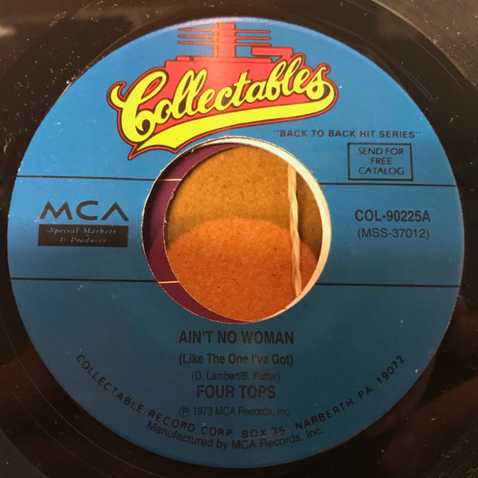

# Ain't No Woman (Like The One I've Got) / The Good Lord Knows

By Four Tops

## Album Data

[Discogs URL](https://www.discogs.com/release/6746613-Four-Tops-Aint-No-Woman-Like-The-One-Ive-Got-The-Good-Lord-Knows)

- Label: ABC/Dunhill Records
- Formats: Vinyl, 7", 45 RPM, Single, Styrene
- Genres: Funk / Soul, Gospel, Soul
- Rating: 4.8
- Released: 1973
- Year: 1973
- Release ID: 6746613
- Media condition: 
- Sleeve condition: 
- Speed: 
- Weight: 
- Notes: 

## Album Tracks

| **Position** | **Title** | **Duration** |
|--------------|-----------|--------------|
| A | **Ain't No Woman (Like The One I've Got)** | 2:59 |
| B | **The Good Lord Knows** | 4:04 |

## Artist Roles

| **Name** | **Role** |
|----------|----------|
| **Brian Potter** | Producer [Produced By] |
| **Dennis Lambert** | Producer [Produced By] |
| **Steve Barri** | Producer [Produced By] |

