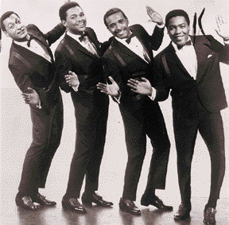

# Four Tops

## Artist Profile

Vocal male soul quartet.

Formed in 1953, in Detroit as The Four Aims.
Made their recording debut in 1955 backing Carolyn Hayes on her Baby Say You Love Me / Really single.
The four founding members remained together for over four decades, until 1997 without a single change in personnel.
In the 60's they were the main male vocal group for the songwriting and production team of Holland-Dozier-Holland. After Holland-Dozier-Holland left Motown in 1967, the Four Tops were assigned to a number of producers, primarily Frank Wilson. When Motown left Detroit in 1972 to move to Los Angeles, California, the Tops stayed in Detroit and moved over to ABC Records, where they continued to have charting singles into the late-1970s. Since the 1980s, the Four Tops have recorded for, at various times, Motown, Casablanca Records and Arista.
Inducted into Rock And Roll Hall of Fame in 1990 (Performer). 
Sometimes credited as "The Four Tops"

Line-Up Chronology:
Lawrence Payton (1953-1997)
Levi Stubbs (1953-2000)
Renaldo "Obie" Benson (1953-2005)
Abdul "Duke" Fakir (1953-present)
Theo Peoples (1998-present)
Ronnie McNeir (2000-present)
Roquel Payton (2005-present)

## Artist Links

- [https://en.wikipedia.org/wiki/Four_Tops](https://en.wikipedia.org/wiki/Four_Tops)
- [http://www.soulwalking.co.uk/Four%20Tops.html](http://www.soulwalking.co.uk/Four%20Tops.html)
- [http://thefourtopsoriginal.com/](http://thefourtopsoriginal.com/)
- [https://www.whosampled.com/Four-Tops/](https://www.whosampled.com/Four-Tops/)
- [https://www.facebook.com/FourTops](https://www.facebook.com/FourTops)

## See also

- [Ain't No Woman (Like The One I've Got) / The Good Lord Knows](Aint_No_Woman_Like_The_One_Ive_Got_-_The_Good_Lord_Knows.md)
