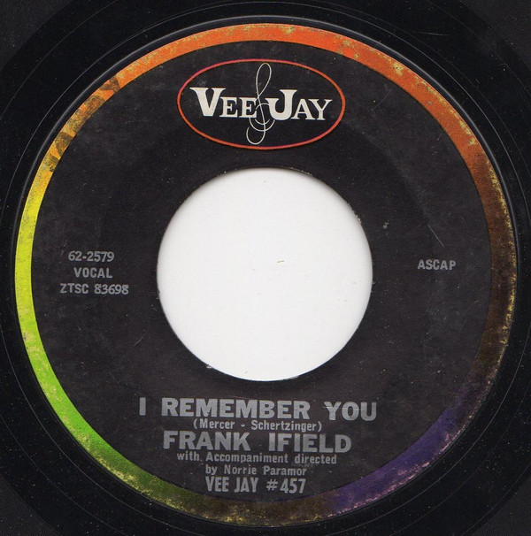

# I Remember You / I Listen To My Heart

By Frank Ifield

## Album Data

[Discogs URL](https://www.discogs.com/release/1327203-Frank-Ifield-I-Remember-You-I-Listen-To-My-Heart)

- Label: Vee Jay Records
- Formats: Vinyl, 7", 45 RPM, Single
- Genres: Rock, Pop Rock
- Rating: 3.9
- Released: 1962-07-00
- Year: 1962
- Release ID: 1327203
- Media condition: 
- Sleeve condition: 
- Speed: 
- Weight: 
- Notes: 

## Album Tracks

| **Position** | **Title** | **Duration** |
|--------------|-----------|--------------|
| A | **I Remember You** |  |
| B | **I Listen To My Heart** |  |

## Artist Roles

| **Name** | **Role** |
|----------|----------|
| **Norrie Paramor** | Directed By [Accompaniment] |

