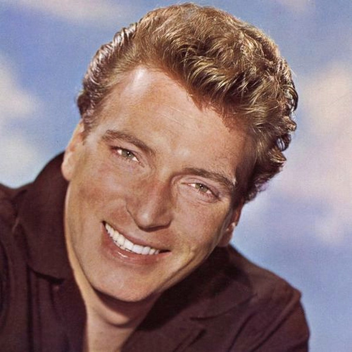

# Frank Ifield

## Artist Profile

Frank Ifield (born 30 November 1937, Coundon, Coventry, England) is an English-born Australian easy listening and country music singer known for his yodeling vocal style. His family emigrated to Australia in 1946. He returned to the UK in 1959 and in 1962 he had a major success with the song "I Remember You". Throughout the 1960's he had a succession of hits which were mainly revivals of American country songs. Inducted into the Australasian Country Music Roll of Renown (2003).

## Artist Links

- [https://www.frankifield.com/](https://www.frankifield.com/)
- [https://en.wikipedia.org/wiki/Frank_Ifield](https://en.wikipedia.org/wiki/Frank_Ifield)
- [https://www.hillbilly-music.com/artists/story/index.php?id=16263](https://www.hillbilly-music.com/artists/story/index.php?id=16263)

## See also

- [I Remember You / I Listen To My Heart](I_Remember_You_-_I_Listen_To_My_Heart.md)
