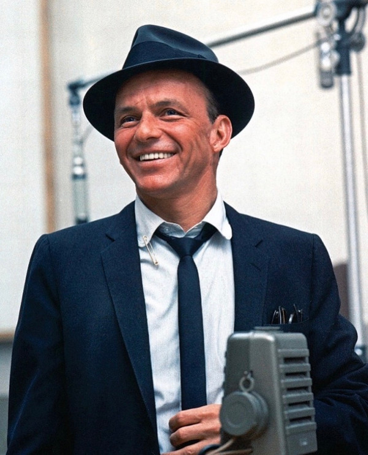

# Frank Sinatra

## Artist Profile

US singer and actor with Italian origins.
Born: 12 December 1915 in Hoboken, New Jersey, USA.
Died: 14 May 1998 in Los Angeles, California, USA.

Nicknamed "The Voice," "Ol' Blue Eyes," "The Chairman Of The Board," and "Frankie Boy." Beginning his musical career in the swing era with Harry James (2) and Tommy Dorsey, Sinatra became a solo artist with great success after signing with Columbia Records in March 1943; he stayed with Columbia until he got dropped by the label in June '52. Sinatra signed a seven-year recording contract with Capitol Records on March 13, 1953, and released several critically lauded albums while with Capitol. Sinatra left Capitol to found his own record label in 1960, Reprise Records, toured internationally, and fraternized with the Rat Pack and President John F. Kennedy in the early 1960s.

Sinatra had three children, Nancy Sinatra (singer, artist), Frank Sinatra Jr. (musician), and Tina Sinatra (TV producer), all with his first wife, Nancy Barbato (married 1939 to 1951). He was married three more times, to actresses Ava Gardner (1951 to 1957) and Mia Farrow (1966 to 1968), and finally to model/showgirl Barbara Marx (married 1976), to whom he was still married at his death.

## Artist Links

- [http://www.sinatra.com](http://www.sinatra.com)
- [https://www.facebook.com/sinatra](https://www.facebook.com/sinatra)
- [https://twitter.com/FrankSinatra](https://twitter.com/FrankSinatra)
- [https://www.youtube.com/user/FrankSinatra](https://www.youtube.com/user/FrankSinatra)
- [https://sinatrafamily.com/](https://sinatrafamily.com/)
- [https://www.britannica.com/biography/Frank-Sinatra](https://www.britannica.com/biography/Frank-Sinatra)
- [https://www.ibdb.com/broadway-cast-staff/frank-sinatra-79640](https://www.ibdb.com/broadway-cast-staff/frank-sinatra-79640)
- [https://www.imdb.com/name/nm0000069/](https://www.imdb.com/name/nm0000069/)
- [https://sinatra.fandom.com/wiki/Frank_Sinatra_Wiki](https://sinatra.fandom.com/wiki/Frank_Sinatra_Wiki)
- [https://en.wikipedia.org/wiki/Frank_Sinatra](https://en.wikipedia.org/wiki/Frank_Sinatra)

## See also

- [In The Wee Small Hours](In_The_Wee_Small_Hours.md)
- [Learnin' The Blues / If I Had Three Wishes](Learnin_The_Blues_-_If_I_Had_Three_Wishes.md)
- [Love And Marriage / The Impatient Years](Love_And_Marriage_-_The_Impatient_Years.md)
