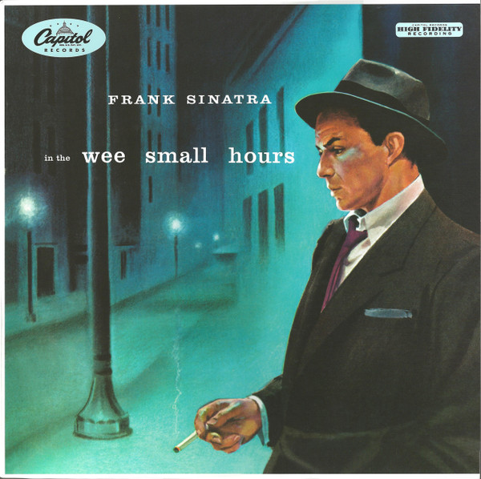

# In The Wee Small Hours

By Frank Sinatra

## Album Data

[Discogs URL](https://www.discogs.com/release/6228536-Frank-Sinatra-In-The-Wee-Small-Hours)

- Label: Capitol Records
UMe
- Formats: Vinyl, LP, Album, Reissue, Remastered, Mono
- Genres: Jazz, Pop, Swing, Ballad, Vocal
- Rating: 4.45
- Released: 2014
- Year: 1955
- Release ID: 6228536
- Media condition: 
- Sleeve condition: 
- Speed: 
- Weight: 
- Notes: 

## Album Tracks

| **Position** | **Title** | **Duration** |
|--------------|-----------|--------------|
| A1 | **In The Wee Small Hours Of The Morning** |  |
| A2 | **Mood Indigo** |  |
| A3 | **Glad To Be Unhappy** |  |
| A4 | **I Get Along Without You Very Well** |  |
| A5 | **Deep In A Dream** |  |
| A6 | **I See Your Face Before Me** |  |
| A7 | **Can't We Be Friends** |  |
| A8 | **When Your Lover Has Gone** |  |
| B1 | **What Is This Thing Called Love** |  |
| B2 | **Last Night When We Were Young** |  |
| B3 | **I'll Be Around** |  |
| B4 | **Ill Wind** |  |
| B5 | **It Never Entered My Mind** |  |
| B6 | **Dancing On The Ceiling** |  |
| B7 | **I'll Never Be The Same** |  |
| B8 | **This Love Of Mine** |  |

## Artist Roles

| **Name** | **Role** |
|----------|----------|
| **Nelson Riddle** | Arranged By, Conductor |
| **Ron McMaster** | Lacquer Cut By |
| **Voyle Gilmore** | Producer |

