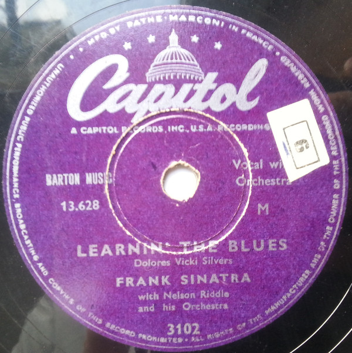

# Learnin' The Blues / If I Had Three Wishes

By Frank Sinatra

## Album Data

[Discogs URL](https://www.discogs.com/release/3235017-Frank-Sinatra-Learnin-The-Blues-If-I-Had-Three-Wishes)

- Label: Capitol Records
- Formats: Vinyl, 7", 45 RPM
- Genres: Pop, Vocal
- Rating: 3.71
- Released: 1955
- Year: 1955
- Release ID: 3235017
- Media condition: 
- Sleeve condition: 
- Speed: 
- Weight: 
- Notes: 

## Album Tracks

| **Position** | **Title** | **Duration** |
|--------------|-----------|--------------|
| A | **Learnin' The Blues** | 2:59 |
| B | **If I Had Three Wishes** | 2:54 |

## Artist Roles

| **Name** | **Role** |
|----------|----------|
| **Nelson Riddle And His Orchestra** | Orchestra |

