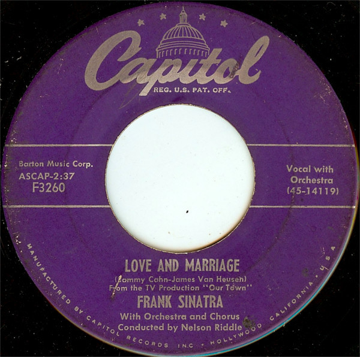

# Love And Marriage / The Impatient Years

By Frank Sinatra

## Album Data

[Discogs URL](https://www.discogs.com/release/1486027-Frank-Sinatra-Love-And-Marriage-The-Impatient-Years)

- Label: Capitol Records
- Formats: Vinyl, 7", Single, 45 RPM
- Genres: Pop, Stage & Screen, Vocal
- Rating: 4
- Released: 1955
- Year: 1955
- Release ID: 1486027
- Media condition: 
- Sleeve condition: 
- Speed: 
- Weight: 
- Notes: 

## Album Tracks

| **Position** | **Title** | **Duration** |
|--------------|-----------|--------------|
| A | **Love And Marriage** | 2:37 |
| B | **The Impatient Years** | 3:13 |

## Artist Roles

| **Name** | **Role** |
|----------|----------|
| **Sammy Cahn & Jimmy Van Heusen** | Written-By |

