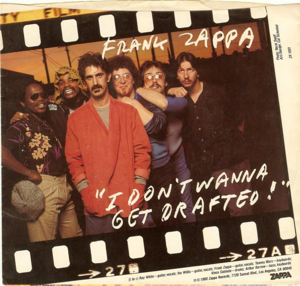

# I Don't Wanna Get Drafted!

By Frank Zappa

## Album Data

[Discogs URL](https://www.discogs.com/release/751230-Frank-Zappa-I-Dont-Wanna-Get-Drafted)

- Label: Zappa Records
Zappa Records
- Formats: Vinyl, 7", 45 RPM, Single, Styrene, Stereo
- Genres: Rock, Funk / Soul, Pop, Alternative Rock, Disco
- Rating: 3.94
- Released: 1980
- Year: 1980
- Release ID: 751230
- Media condition: 
- Sleeve condition: 
- Speed: 
- Weight: 
- Notes: 

## Album Tracks

| **Position** | **Title** | **Duration** |
|--------------|-----------|--------------|
| A | **I Don't Wanna Get Drafted** | 3:10 |
| B | **Ancient Armaments** | 4:10 |

## Artist Roles

| **Name** | **Role** |
|----------|----------|
| **Cal Schenkel** | Artwork, Design |
| **Arthur Barrow** | Bass, Keyboards |
| **Frank Zappa** | Composed By, Arranged By, Conductor |
| **Vinnie Colaiuta** | Drums |
| **Frank Zappa** | Guitar, Vocals |
| **Ike Willis** | Guitar, Vocals |
| **Ray White** | Guitar, Vocals |
| **Tommy Mars** | Keyboards |
| **Norman Seeff** | Photography By |

