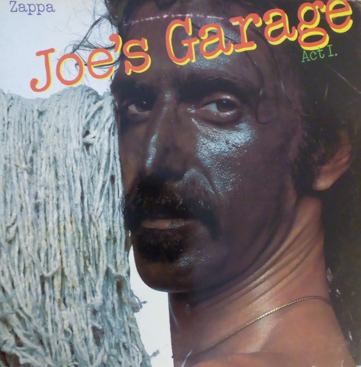

# Joe's Garage Acts 1, 2 & 3

By Frank Zappa

## Album Data

[Discogs URL](https://www.discogs.com/release/9484648-Zappa-Joes-Garage-Acts-1-2-3)

- Label: Zappa Records
- Formats: Vinyl, LP, Album, Reissue, Remastered
- Genres: Jazz, Rock, Avantgarde, Jazz-Rock, Parody
- Rating: 4.82
- Released: 2016-12-09
- Year: 1987
- Release ID: 9484648
- Media condition: 
- Sleeve condition: 
- Speed: 
- Weight: 
- Notes: 

## Album Tracks

| **Position** | **Title** | **Duration** |
|--------------|-----------|--------------|
| A1 | **The Central Scrutinizer** | 3:27 |
| A2 | **Joe's Garage** | 6:10 |
| A3 | **Catholic Girls** | 4:26 |
| A4 | **Crew Slut** | 5:51 |
| B1 | **Wet T-Shirt Nite** | 5:26 |
| B2 | **Toad-O-Line** | 4:18 |
| B3 | **Why Does It Hurt When I Pee?** | 2:35 |
| B4 | **Lucille Has Messed My Mind Up** | 7:17 |
| C1 | **A Token Of My Extreme** | 5:28 |
| C2 | **Stick It Out** | 4:33 |
| C3 | **Sy Borg** | 8:50 |
| D1 | **Dong Work For Yuda** | 5:03 |
| D2 | **Keep It Greasey** | 8:22 |
| D3 | **Outside Now** | 5:52 |
| E1 | **He Used To Cut The Grass** | 8:34 |
| E2 | **Packard Goose** | 11:38 |
| F1 | **Watermelon In Easter Hay** | 10:00 |
| F2 | **A Little Green Rosetta** | 7:25 |

## Artist Roles

| **Name** | **Role** |
|----------|----------|
| **Marginal Chagrin** | Baritone Saxophone |
| **Stumuk** | Bass Saxophone |
| **Arthur Barrow** | Bass, Vocals |
| **Vinnie Colaiuta** | Drums |
| **Joe Chiccarelli** | Engineer [Recording] |
| **Mick Glossop** | Engineer [Remix] |
| **Steve Nye** | Engineer [Remix] |
| **Craig Steward** | Harmonica |
| **Peter Wolf (3)** | Keyboards |
| **Tommy Mars** | Keyboards |
| **Frank Zappa** | Lead Guitar, Vocals, Arranged By, Conductor |
| **Ike Willis** | Lead Vocals |
| **Bernie Grundman** | Mastered By |
| **Ed Mann** | Percussion |
| **Frank Zappa** | Producer |
| **Warren Cuccurullo** | Rhythm Guitar, Vocals |
| **Denny Walley** | Slide Guitar, Vocals |
| **Jeff Hollie** | Tenor Saxophone |
| **Al Malkin** | Vocals |
| **Dale Bozzio** | Vocals |
| **Ed Mann** | Vocals |

