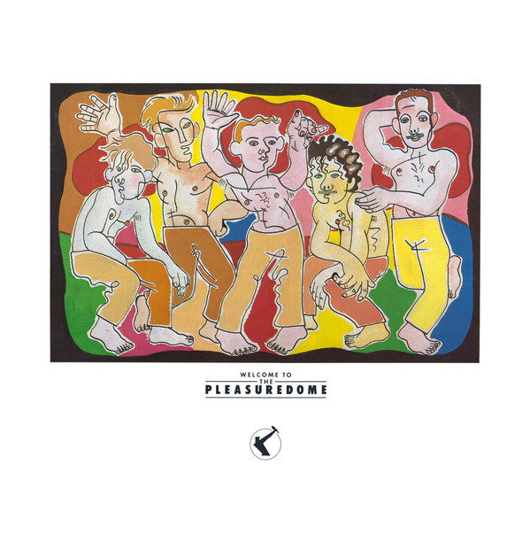

# Welcome To The Pleasuredome

By Frankie Goes To Hollywood

## Album Data

[Discogs URL](https://www.discogs.com/release/37042-Frankie-Goes-To-Hollywood-Welcome-To-The-Pleasuredome)

- Label: Island Records
Island Records
ZTT
ZTT
- Formats: Vinyl, LP, Album, Stereo
- Genres: Electronic, Rock, Synth-pop
- Rating: 4.01
- Released: 1984
- Year: 1984
- Release ID: 37042
- Media condition: 
- Sleeve condition: 
- Speed: 
- Weight: 
- Notes: 

## Album Tracks

| **Position** | **Title** | **Duration** |
|--------------|-----------|--------------|
|  | **F (Pray Frankie Pray)** |  |
| A1 | **Well...** | 0:55 |
| A2 | **The World Is My Oyster** | 1:02 |
| A3 | **Snatch Of Fury (Stay)** | 1:23 |
| A4 | **Welcome To The Pleasure Dome** | 12:15 |
|  | **G (Say Frankie Say)** |  |
| B1 | **Relax (Come Fighting)** | 3:55 |
| B2 | **War (...And Hide)** | 6:12 |
| B3 | **Two Tribes (For The Victims Of Ravishment)** | 3:22 |
| B4 | **(Tag)** | 0:33 |
|  | **T (Stay Frankie Stay)** |  |
| C1 | **Ferry (Go)** | 1:41 |
| C2 | **Born To Run** | 4:04 |
| C3 | **San Jose (The Way)** | 3:07 |
| C4 | **Wish (The Lads Were Here) Including The Ballad Of 32** | 7:34 |
|  | **H (Play Frankie Play)** |  |
| D1 | **Krisco Kisses** | 2:57 |
| D2 | **Black Night White Light** | 4:05 |
| D3 | **The Only Star In Heaven** | 4:16 |
| D4 | **The Power Of Love** | 5:29 |
| D5 | **Bang...** | 1:07 |

## Artist Roles

| **Name** | **Role** |
|----------|----------|
| **Steve Howe** | Acoustic Guitar |
| **Anne Dudley** | Arranged By [String Arrangement] |
| **XLZTT** | Art Direction [Dome Souvenirs Models Were Ordered About By] |
| **Lo Cole** | Artwork [Colours On The Cover] |
| **Mark O'Toole** | Bass, Vocals |
| **ZTT** | Coordinator [Co-ordination] |
| **Bazaar (12)** | Costume Designer [Pleasure Guard-In Clothes] |
| **Jean Paul Gaultier** | Costume Designer [Pleasure Guard-In Clothes] |
| **XL Design** | Design |
| **ZTT** | Design |
| **Peter Gill** | Drums |
| **Stuart Bruce** | Engineer [The Lads Were Engineered By] |
| **Stephen Lipson** | Engineer, Producer [Production Assistant] |
| **Brian Nash** | Guitar |
| **Stephen Lipson** | Guitar [Lipson Service Guitar] |
| **Anne Dudley** | Keyboards [Additional] |
| **Andy Richards** | Keyboards, Other [Pottery] |
| **Greg Calbi** | Lacquer Cut By [Runout Etching ☆] |
| **Holly Johnson** | Lead Vocals [The Voice] |
| **Debbie Bunn** | Make-Up [Dome Souvenirs Models Made Up By] |
| **Lynne Easton** | Make-Up [Pleasure Guard-In Make Up] |
| **Nu-Visions Management Ltd.** | Management |
| **Greg Calbi** | Mastered By |
| **Ian Cooper** | Mastered By |
| **Paul Rutherford** | Model [Dome Souvenirs Modelled By] |
| **Luis Jardim** | Percussion, Other [Cignals] |
| **Anton Corbijn** | Photography By [Black And White, Dutch Pink] |
| **Peter Brown (23)** | Photography By [Dome Souvenirs] |
| **Steve Romney** | Photography By [Party] |
| **Peter Ashworth** | Photography By [Pleasure Guard-In] |
| **John Stoddart (2)** | Photography By [Pre Bang Liverpool] |
| **Tony Barratt (2)** | Photography By [Video] |
| **Eric Watson (3)** | Photography By [Wargames] |
| **Trevor Horn** | Producer [Produced And All That] |
| **Stephen Lipson** | Soloist, Guitar [Lipson Service Guitar] |
| **Iain R. Webb** | Stylist [Dome Souvenirs Models Styled By] |
| **Bashia (2)** | Stylist [Pleasure Guard-In Stylist] |
| **J.J. Jeczalik** | Technician [Software, Hardware], Other [The Fifth Dimension] |
| **Paul Morley** | Text By [Acted During The Bang] |
| **Paul Rutherford** | Vocals, Other ['I Came To Dance'] |
| **Christopher Barrie** | Voice Actor [Acted During The Bang] |
| **Patrick Allen** | Voice Actor [Acted During The Bang] |
| **Andy Richards** | Written-By |
| **Bacharach And David** | Written-By |
| **Bruce Springsteen** | Written-By |
| **Frankie Goes To Hollywood** | Written-By |
| **Gerry Marsden** | Written-By |
| **Whitfield-Strong** | Written-By |

