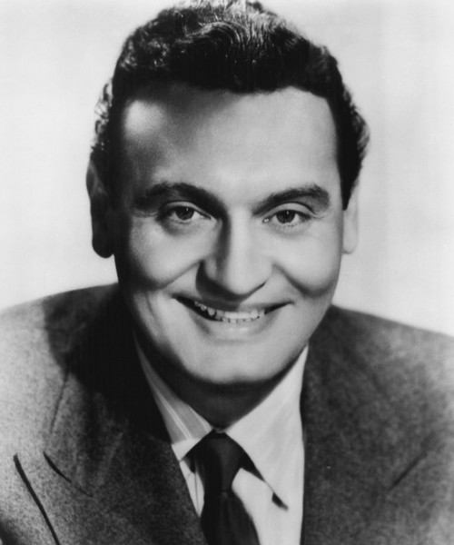

# Frankie Laine

## Artist Profile

Born: March 30, 1913 // Chicago, IL, United States 
Died: February 6, 2007 // San Diego, CA, United States
Singer, composer and author Frankie Laine was born March 30, 1913 in Chicago. His real name was Francesco Paulo LoVecchio and he lived in Chicago's Little Italy. Frankie was the oldest of eight children born to Sicilian immigrants John and Anna Lo Vecchio, who had come from Monreale, Sicily near Palermo
American singer and songwriter, often billed as America's Number One Song Stylist, Mr. Rhythm, Old Leather Lungs, and Old Man Jazz.

## Artist Links

- [http://en.wikipedia.org/wiki/Frankie_Laine](http://en.wikipedia.org/wiki/Frankie_Laine)
- [http://www.imdb.com/name/nm0481840/bio](http://www.imdb.com/name/nm0481840/bio)

## See also

- [I'll Take Care Of Your Cares](Ill_Take_Care_Of_Your_Cares.md)
