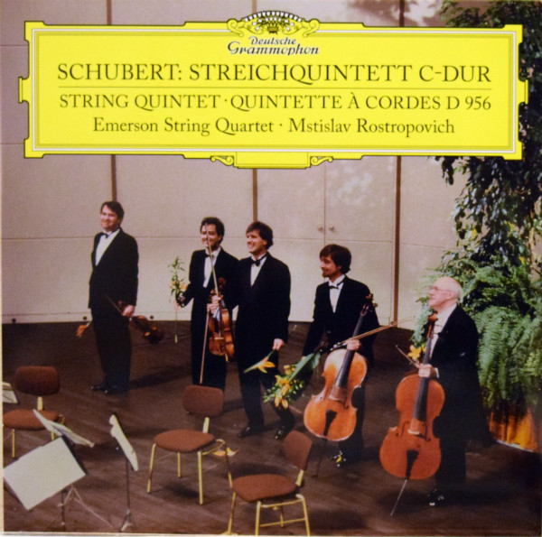

# Streichquintett C-Dur

By Franz Schubert

## Album Data

[Discogs URL](https://www.discogs.com/release/6671776-Schubert-Emerson-String-Quartet-Mstislav-Rostropovich-Streichquintett-C-Dur)

- Label: Deutsche Grammophon
- Formats: Vinyl, LP, Album, Reissue
- Genres: Classical
- Rating: 4.25
- Released: 2015-02-18
- Year: 1992
- Release ID: 6671776
- Media condition: 
- Sleeve condition: 
- Speed: 
- Weight: 
- Notes: 

## Album Tracks

| **Position** | **Title** | **Duration** |
|--------------|-----------|--------------|
|  | **Streichquintett C-Dur, D 956 (Op. Post. 163)** |  |

## Artist Roles

| **Name** | **Role** |
|----------|----------|
| **David Finckel** | Cello |
| **Mstislav Rostropovich** | Cello |
| **Franz Schubert** | Composed By |
| **Christopher Alder** | Edited By |
| **Dr. Steven Paul** | Executive Producer |
| **Werner Neumeister** | Photography By |
| **Christopher Alder** | Producer |
| **Gernot Von Schultzendorff** | Recording Supervisor |
| **Lawrence Dutton** | Viola |
| **Eugene Drucker** | Violin |
| **Philip Setzer** | Violin |

