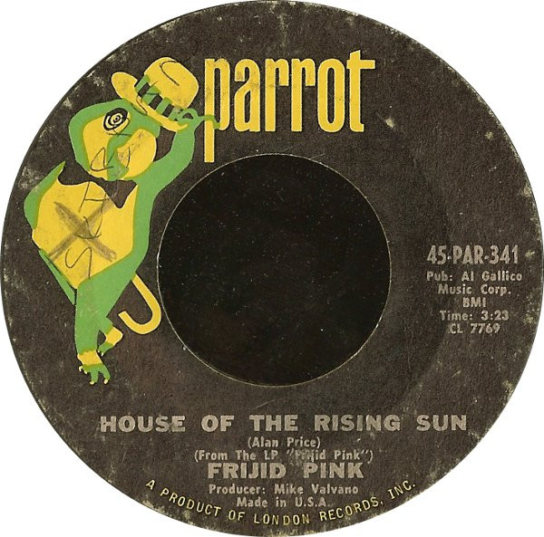

# The House Of The Rising Sun

By Frijid Pink

## Album Data

[Discogs URL](https://www.discogs.com/release/1482232-Frijid-Pink-The-House-Of-The-Rising-Sun)

- Label: Parrot
- Formats: Vinyl, 7", 45 RPM, Single
- Genres: Rock, Prog Rock, Classic Rock
- Rating: 4.07
- Released: 1970
- Year: 1970
- Release ID: 1482232
- Media condition: 
- Sleeve condition: 
- Speed: 
- Weight: 
- Notes: 

## Album Tracks

| **Position** | **Title** | **Duration** |
|--------------|-----------|--------------|
| A | **The House Of The Rising Sun** | 3:23 |
| B | **Drivin' Blues** | 3:14 |

## Artist Roles

| **Name** | **Role** |
|----------|----------|
| **Michael Valvano** | Producer |

