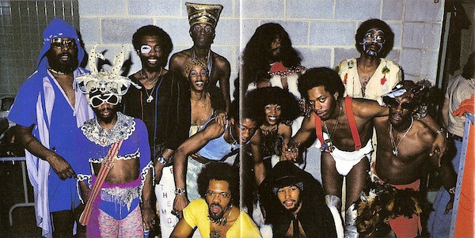

# Funkadelic

## Artist Profile

Funkadelic is an American band most prominent during the 1970s. The band and its sister act Parliament, both led by George Clinton, began the funk music culture of that decade.
Inducted into Rock And Roll Hall of Fame in 1997 (Performer).

## Artist Links

- [https://myspace.com/funkadelicparliament](https://myspace.com/funkadelicparliament)
- [https://en.wikipedia.org/wiki/Funkadelic](https://en.wikipedia.org/wiki/Funkadelic)
- [https://en.wikipedia.org/wiki/Funkadelic](https://en.wikipedia.org/wiki/Funkadelic)
- [https://www.imdb.com/name/nm1578977/](https://www.imdb.com/name/nm1578977/)
- [https://www.whosampled.com/Funkadelic/](https://www.whosampled.com/Funkadelic/)
- [http://www.soulwalking.co.uk/Funkadelic.html](http://www.soulwalking.co.uk/Funkadelic.html)

## See also

- [Maggot Brain](Maggot_Brain.md)
