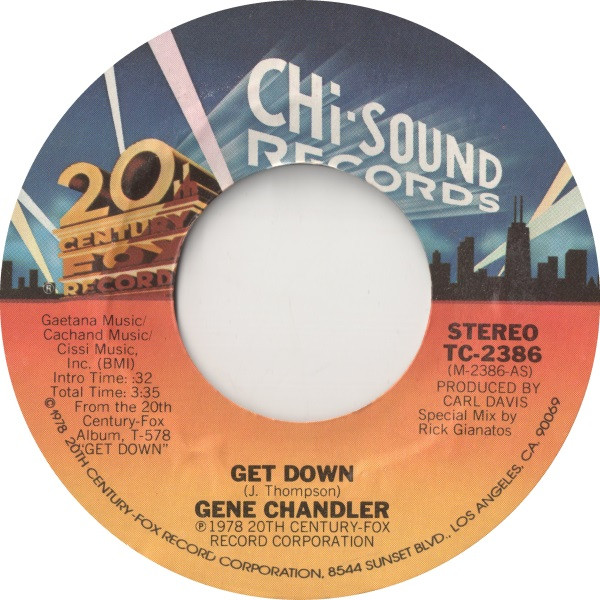

# Get Down

By Gene Chandler

## Album Data

[Discogs URL](https://www.discogs.com/release/1770144-Gene-Chandler-Get-Down)

- Label: 20th Century Fox Records
Chi Sound Records
- Formats: Vinyl, 7", 45 RPM, Single, Styrene
- Genres: Funk / Soul, Funk, Disco
- Rating: 4.08
- Released: 1978
- Year: 1978
- Release ID: 1770144
- Media condition: 
- Sleeve condition: 
- Speed: 
- Weight: 
- Notes: 

## Album Tracks

| **Position** | **Title** | **Duration** |
|--------------|-----------|--------------|
| A | **Get Down** | 3:35 |
| B | **I'm The Traveling Kind** | 4:06 |

## Artist Roles

| **Name** | **Role** |
|----------|----------|
| **Wally Traugott** | Mastered By |
| **Carl Davis** | Producer [Produced By] |

