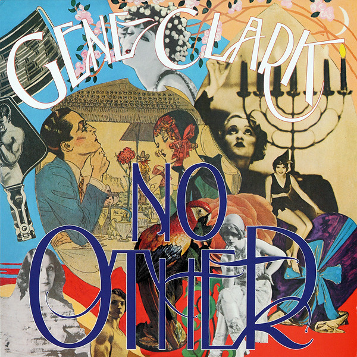

# No Other

By Gene Clark

## Album Data

[Discogs URL](https://www.discogs.com/release/3601360-Gene-Clark-No-Other)

- Label: 4 Men With Beards
- Formats: Vinyl, LP, Album, Reissue
- Genres: Rock, Pop, Folk, World, & Country, Country Rock, Pop Rock
- Rating: 4.6
- Released: 2012
- Year: 1974
- Release ID: 3601360
- Media condition: 
- Sleeve condition: 
- Speed: 
- Weight: 
- Notes: 

## Album Tracks

| **Position** | **Title** | **Duration** |
|--------------|-----------|--------------|
| A1 | **Life's Greatest Fool** | 4:44 |
| A2 | **Silver Raven** | 4:53 |
| A3 | **No Other** | 5:08 |
| A4 | **Strength Of Strings** | 6:30 |
| B1 | **From A Silver Phial** | 3:40 |
| B2 | **Some Misunderstanding** | 8:10 |
| B3 | **The True One** | 4:57 |
| B4 | **Lady Of The North** | 6:04 |

