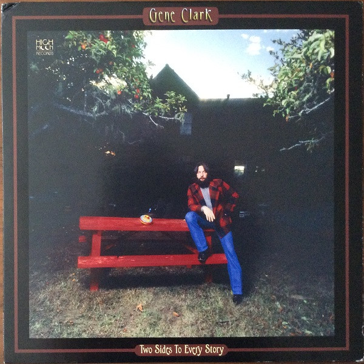

# Two Sides To Every Story

By Gene Clark

## Album Data

[Discogs URL](https://www.discogs.com/release/4592772-Gene-Clark-Two-Sides-To-Every-Story)

- Label: High Moon Records
Universal Music Special Markets
- Formats: Vinyl, LP, Album, Limited Edition, Numbered, Remastered
- Genres: Rock, Folk, World, & Country
- Rating: 4.51
- Released: 2013
- Year: 1977
- Release ID: 4592772
- Media condition: 
- Sleeve condition: 
- Speed: 
- Weight: 
- Notes: 

## Album Tracks

| **Position** | **Title** | **Duration** |
|--------------|-----------|--------------|
| A1 | **Home Run King** | 2:57 |
| A2 | **Lonely Saturday** | 4:04 |
| A3 | **In The Pines** | 4:22 |
| A4 | **Kansas City Southern** | 4:38 |
| A5 | **Give My Love To Marie** | 6:05 |
| B1 | **Sister Moon** | 5:06 |
| B2 | **Marylou** | 3:31 |
| B3 | **Hear The Wind** | 3:06 |
| B4 | **Past Addresses** | 5:22 |
| B5 | **Silent Crusade** | 4:12 |

## Artist Roles

| **Name** | **Role** |
|----------|----------|
| **David Campbell** | Arranged By [String Arrangements] |
| **Steve Stanley (2)** | Art Direction, Design |
| **MPS (4)** | Artwork [Deluxe Packaging By] |
| **Daniel Moore** | Backing Vocals |
| **Doug Dillard** | Backing Vocals |
| **Emmylou Harris** | Backing Vocals |
| **John Hartford** | Backing Vocals |
| **Matthew Moore** | Backing Vocals |
| **Pepper Watkins** | Backing Vocals |
| **Steven Soles** | Backing Vocals |
| **Thomas Kaye** | Backing Vocals |
| **Doug Dillard** | Banjo |
| **Jim Fielder** | Bass |
| **Birdie Breeze** | Coordinator [Project Coordination] |
| **David Larkham** | Design |
| **Sammy Creason** | Drums |
| **Gary Legon** | Executive-Producer |
| **Byron Berline** | Fiddle |
| **Michael Utley** | Keyboards |
| **Jerry McGee** | Lead Guitar [Lead Electric & Acoustic Guitar] |
| **Paul Sommerstein** | Legal |
| **John Einarson** | Liner Notes |
| **George Baer Wallace** | Liner Notes [With Contributions From] |
| **Sheryl Farber** | Liner Notes [With Contributions From] |
| **Tom Sandford** | Liner Notes [With Contributions From] |
| **Dan Hersch** | Mastered By |
| **Doug Sax** | Mastered By [Mastered For Vinyl By] |
| **Robert Hadley** | Mastered By [Mastered For Vinyl By] |
| **Al Perkins** | Pedal Steel Guitar |
| **Murray Neitlich** | Photography By [Booklet Pg. 3] |
| **Ed Caraeff** | Photography By, Art Direction |
| **Thomas Kaye** | Producer |
| **Shore Fire Media** | Public Relations |
| **Joel Soyffer** | Recorded By |
| **George Baer Wallace** | Reissue Producer [Produced For Release By] |
| **J.D. Martignon** | Reissue Producer [Produced For Release By] |
| **Roger Nichols** | Remix |
| **Jeff Baxter** | Rhythm Guitar [Rhythm Electric & Acoustic Guitar] |
| **Sheryl Farber** | Supervised By [Editorial Supervision] |
| **John Strother** | Transferred By [Tape Transfers] |

