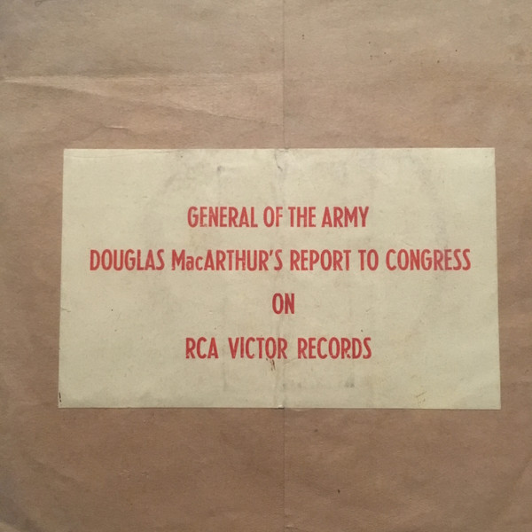

# Report To Congress  April 19, 1951

By General Douglas MacArthur

## Album Data

[Discogs URL](https://www.discogs.com/release/7125011-General-Douglas-MacArthur-Report-To-Congress-April-19-1951)

- Label: RCA Victor
- Formats: Vinyl
Box Set, 7", 45 RPM, Album
- Genres: Non-Music, Speech
- Rating: 5
- Released: 1951
- Year: 1951
- Release ID: 7125011
- Media condition: 
- Sleeve condition: 
- Speed: 
- Weight: 
- Notes: 

## Album Tracks

| **Position** | **Title** | **Duration** |
|--------------|-----------|--------------|
| A | **Report To Congress  April 19, 1951 Part1** |  |
| B | **Report To Congress  April 19, 1951 (Part 2)** |  |
| C | **Report To Congress  April 19, 1951 (Part 3)** |  |
| D | **Report To Congress  April 19, 1951 (Part 4)** |  |
| E | **Report To Congress  April 19, 1951 (Part 5)** |  |
| F | **Report To Congress  April 19, 1951 (Part 6)** |  |

