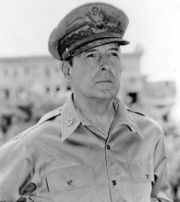

# General Douglas MacArthur

## Artist Profile

American General, United Nations General, and Field Marshal of the Philippine Army, born 26 January 1880 in Little Rock, Arkansas, USA, died 5 April 1964 in Washington D.C., USA.

## Artist Links

## See also

- [Report To Congress  April 19, 1951](Report_To_Congress_April_19__1951.md)
