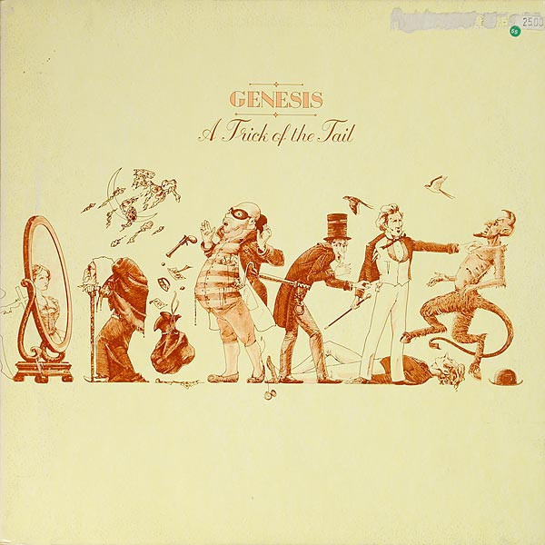

# A Trick Of The Tail

By Genesis

## Album Data

[Discogs URL](https://www.discogs.com/release/691567-Genesis-A-Trick-Of-The-Tail)

- Label: ATCO Records
- Formats: Vinyl, LP, Album, Reissue, Stereo
- Genres: Rock, Prog Rock
- Rating: 4.41
- Released: 1977
- Year: 1976
- Release ID: 691567
- Media condition: 
- Sleeve condition: 
- Speed: 
- Weight: 
- Notes: 

## Album Tracks

| **Position** | **Title** | **Duration** |
|--------------|-----------|--------------|
| A1 | **Dance On A Volcano** | 5:53 |
| A2 | **Entangled** | 6:26 |
| A3 | **Squonk** | 6:27 |
| A4 | **Mad Man Moon** | 7:35 |
| B1 | **Robbery, Assault & Battery** | 6:15 |
| B2 | **Ripples** | 8:03 |
| B3 | **A Trick Of The Tail** | 4:34 |
| B4 | **Los Endos** | 5:46 |

## Artist Roles

| **Name** | **Role** |
|----------|----------|
| **Mike Rutherford** | Bass, Twelve-String Guitar, Pedalboard |
| **David Hentschel** | Co-producer |
| **Genesis** | Co-producer |
| **Phil Collins** | Drums, Percussion, Lead Vocals, Backing Vocals |
| **Steve Hackett** | Electric Harmonium, Twelve-String Guitar |
| **David Hentschel** | Engineer |
| **Nick Bradford** | Engineer |
| **Tex And Jeff** | Other [Equipment] |
| **Neal, John And Terry** | Other [Liquid Sustenance] |
| **Tony Banks** | Piano, Synthesizer, Organ, Mellotron, Twelve-String Guitar, Backing Vocals |
| **Colin Elgie** | Sleeve [Design] |

