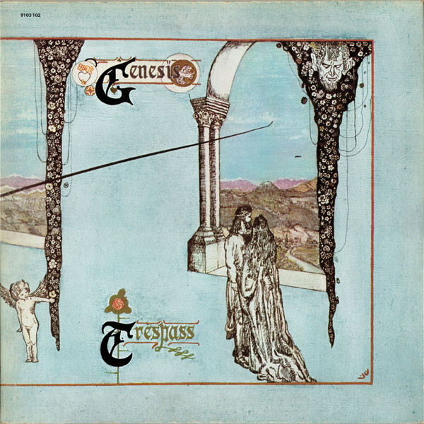

# Trespass

By Genesis

## Album Data

[Discogs URL](https://www.discogs.com/release/7048006-Genesis-Trespass)

- Label: ABC Records
- Formats: Vinyl, LP, Album, Reissue
- Genres: Rock, Prog Rock
- Rating: 4.33
- Released: 1974
- Year: 1970
- Release ID: 7048006
- Media condition: 
- Sleeve condition: 
- Speed: 
- Weight: 
- Notes: 

## Album Tracks

| **Position** | **Title** | **Duration** |
|--------------|-----------|--------------|
| A1 | **Looking For Someone** | 7:00 |
| A2 | **White Mountain** | 7:00 |
| A3 | **Visions Of Angels** | 7:00 |
| B1 | **Stagnation** | 8:45 |
| B2 | **Dusk** | 4:15 |
| B3 | **The Knife** | 8:55 |

## Artist Roles

| **Name** | **Role** |
|----------|----------|
| **Mike Rutherford** | Acoustic Guitar [12 String], Bass [Electric 12-string], Cello, Backing Vocals, Guitar [Nylon] |
| **Anthony Phillips** | Acoustic Guitar [12 String], Guitar [Lead Electric], Dulcimer, Backing Vocals |
| **Genesis** | Arranged By, Composed By |
| **Paul Whitehead** | Artwork |
| **John Mayhew** | Drums, Percussion, Backing Vocals |
| **Robin Geoffrey Cable** | Engineer |
| **Peter Gabriel** | Lead Vocals, Flute, Accordion, Tambourine, Bass Drum |
| **Tony Banks** | Organ, Piano, Mellotron, Guitar, Backing Vocals |
| **John Anthony** | Producer |

