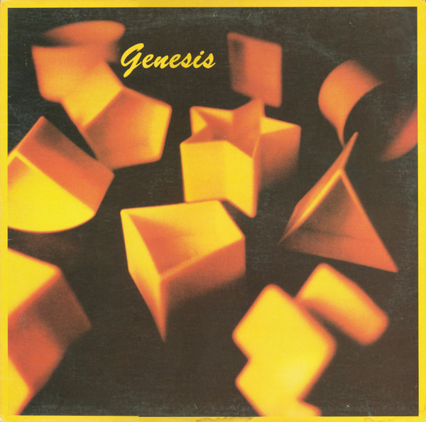

# Genesis

By Genesis

## Album Data

[Discogs URL](https://www.discogs.com/release/1028168-Genesis-Genesis)

- Label: Atlantic
Atlantic
- Formats: Vinyl, LP, Album
- Genres: Rock, Pop Rock
- Rating: 3.97
- Released: 1983
- Year: 1983
- Release ID: 1028168
- Media condition: 
- Sleeve condition: 
- Speed: 
- Weight: 
- Notes: 

## Album Tracks

| **Position** | **Title** | **Duration** |
|--------------|-----------|--------------|
| A1 | **Mama** | 6:46 |
| A2 | **That's All** | 4:22 |
| A3 | **Home By The Sea** | 4:46 |
| A4 | **Second Home By The Sea** | 6:22 |
| B1 | **Illegal Alien** | 5:12 |
| B2 | **Taking It All Too Hard** | 3:54 |
| B3 | **Just A Job To Do** | 4:44 |
| B4 | **Silver Rainbow** | 4:27 |
| B5 | **It's Gonna Get Better** | 5:00 |

## Artist Roles

| **Name** | **Role** |
|----------|----------|
| **Bill Smith (19)** | Cover |
| **Phil Collins** | Drums, Percussion, Lead Vocals |
| **Hugh Padgham** | Engineer |
| **Mike Rutherford** | Guitar, Bass, Backing Vocals |
| **Tony Banks** | Keyboards, Backing Vocals |
| **Pounda** | Mastered By |
| **Genesis** | Producer |
| **Hugh Padgham** | Producer [With] |
| **Geoff Callingham** | Technician [Technical Assistance] |
| **Genesis** | Written-By [All Songs Written By] |

