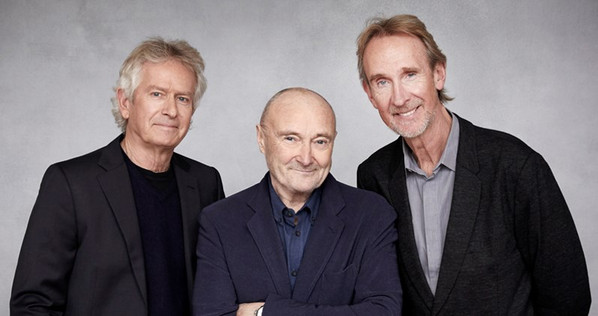

# Genesis

## Artist Profile

Formed at Charterhouse School, Godalming, Surrey, South East England, UK in 1967, Genesis are among the top 30 highest-selling recording artists of all time.

Their early work is characterized by complex song structures, elaborate instrumentation and the theatrical antics of founder member and vocalist Peter Gabriel, who left the band August 15, 1975. Unable to find a suitable replacement, it was drummer Phil Collins who assumed lead vocal duties. This change, as well as the departure of guitarist Steve Hackett, two years later, saw the remaining three members (Phil Collins, keyboardist Tony Banks and bassist/guitarist Mike Rutherford) move into more accessible pop-based music. This change in style resulted in a huge growth in Genesis' popularity throughout the 1980s and early 1990s.

In 1996 Phil Collins left to concentrate on his solo work and other projects, leaving erstwhile bandmates Mike Rutherford and Tony Banks to forge ahead with new recruit; Stiltskin vocalist Ray Wilson. This line-up lasted for one album only (1997's Calling All Stations) and Genesis soon found itself on hiatus after the poor performance and critical reaction of the new album.

In 2006 – after years of speculation – Phil Collins, Tony Banks and Mike Rutherford reformed Genesis for the successful Turn It On Again tour. A reunion involving ex-members Peter Gabriel and Steve Hackett remains much talked-about and unrealised.

Inducted into the Rock & Roll Hall of Fame in 2010 (performer).

Band members:
● Peter Gabriel – lead vocals, flute, percussion (1967–1975, 1978, 1982, 1999)
● Tony Banks – keyboards, backing vocals (1967–1998, 1999, 2000, 2006–2007), 12 string acoustic guitar (1967–1979)
● Anthony Phillips – guitar, backing vocals (1967–1970)
● Mick Barnard – guitar (1970–1971)
● Steve Hackett – guitar (1971–1977, 1982, 1999)
● Mike Rutherford – bass, bass pedals, 6 & 12 string electric guitar, backing vocals (1967–1998, 1999, 2000, 2006–2007)
● Chris Stewart (7) – drums, percussion (1967–1968)
● John Silver (2) – drums, percussion (1968–1969)
● John Mayhew – drums, percussion, backing vocals (1969–1970)
● Phil Collins – drums, lead & backing vocals (1972–1996, 1999, 2000, 2006–2007)
● Ray Wilson – lead vocals (1996–1998)

Touring/session musicians:
● Bill Bruford – drums, percussion (1976)
● Chester Thompson – drums, percussion (1977–1995, 2006–2007)
● Daryl Stuermer – guitar, bass (1978-1995, 2006-present)
● Nir Zidkyahu – drums, percussion (1996–1998)
● Nick D'Virgilio – drums, percussion (on 1997 album Calling All Stations)
● Anthony Drennan – guitar, bass (1998)
● Nicholas Collins – drums (2021)

## Artist Links

- [https://www.genesis-music.com/](https://www.genesis-music.com/)
- [https://www.facebook.com/genesis](https://www.facebook.com/genesis)
- [https://twitter.com/genesis_band](https://twitter.com/genesis_band)
- [https://www.instagram.com/genesis_band/](https://www.instagram.com/genesis_band/)
- [https://www.youtube.com/user/OfficialGenesis](https://www.youtube.com/user/OfficialGenesis)
- [https://www.genesis-movement.org/](https://www.genesis-movement.org/)
- [https://thegenesisarchive.co.uk/](https://thegenesisarchive.co.uk/)
- [https://www.facebook.com/TheGenesisArchive/](https://www.facebook.com/TheGenesisArchive/)
- [https://twitter.com/genesisarchive](https://twitter.com/genesisarchive)
- [https://www.youtube.com/thegenesisarchive](https://www.youtube.com/thegenesisarchive)
- [http://www.worldofgenesis.com/](http://www.worldofgenesis.com/)
- [https://twitter.com/WorldofGenesis](https://twitter.com/WorldofGenesis)
- [http://www.progarchives.com/artist.asp?id=1](http://www.progarchives.com/artist.asp?id=1)
- [https://en.wikipedia.org/wiki/Genesis_(band)](https://en.wikipedia.org/wiki/Genesis_(band))

## See also

- [A Trick Of The Tail](A_Trick_Of_The_Tail.md)
- [Genesis](Genesis.md)
- [Selling England By The Pound](Selling_England_By_The_Pound.md)
- [Trespass](Trespass.md)
