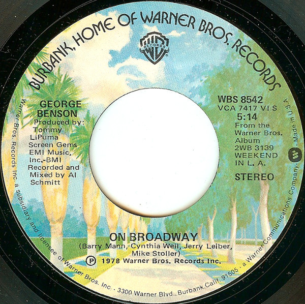

# On Broadway

By George Benson

## Album Data

[Discogs URL](https://www.discogs.com/release/4972469-George-Benson-On-Broadway)

- Label: Warner Bros. Records
- Formats: Vinyl, 7", 45 RPM, Single, Styrene, Stereo
- Genres: Jazz, Funk / Soul, Funk, Disco
- Rating: 4
- Released: 1978
- Year: 1978
- Release ID: 4972469
- Media condition: 
- Sleeve condition: 
- Speed: 
- Weight: 
- Notes: 

## Album Tracks

| **Position** | **Title** | **Duration** |
|--------------|-----------|--------------|
| A | **On Broadway** | 5:14 |
| B | **We As Love** | 6:43 |

## Artist Roles

| **Name** | **Role** |
|----------|----------|
| **Al Schmitt** | Mixed By, Recorded By |
| **Tommy LiPuma** | Producer [Produced By] |

