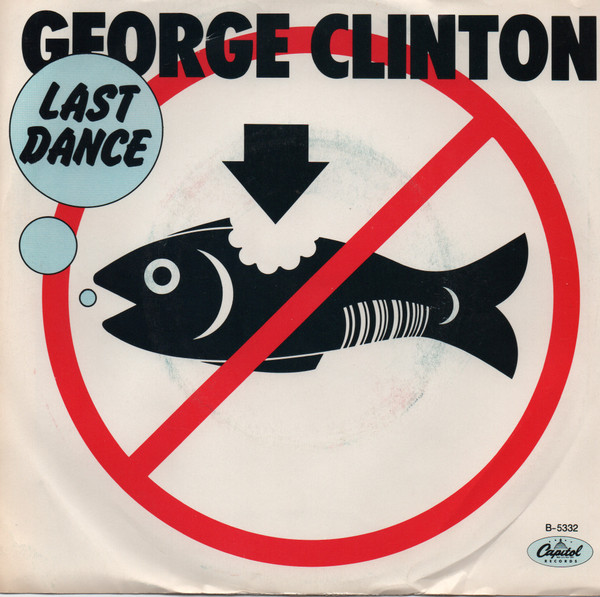

# Last Dance

By George Clinton

## Album Data

[Discogs URL](https://www.discogs.com/release/3269475-George-Clinton-Last-Dance)

- Label: Capitol Records
- Formats: Vinyl, 7", 45 RPM, Single
- Genres: Funk / Soul, P.Funk
- Rating: 3.5
- Released: 1983
- Year: 1983
- Release ID: 3269475
- Media condition: 
- Sleeve condition: 
- Speed: 
- Weight: 
- Notes: 

## Album Tracks

| **Position** | **Title** | **Duration** |
|--------------|-----------|--------------|
| A | **Last Dance** | 3:47 |
| B | **Get Dressed** | 3:39 |

