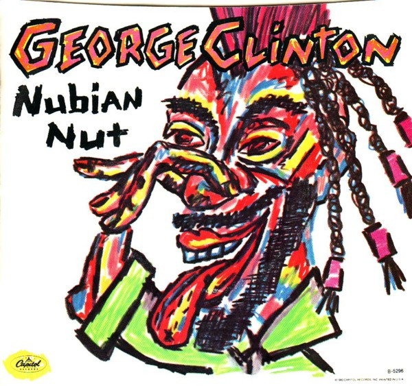

# Nubian Nut

By George Clinton

## Album Data

[Discogs URL](https://www.discogs.com/release/4146523-George-Clinton-Nubian-Nut)

- Label: Capitol Records
- Formats: Vinyl, 7", 45 RPM, Single
- Genres: Funk / Soul, P.Funk
- Rating: 4.17
- Released: 1983
- Year: 1983
- Release ID: 4146523
- Media condition: 
- Sleeve condition: 
- Speed: 
- Weight: 
- Notes: 

## Album Tracks

| **Position** | **Title** | **Duration** |
|--------------|-----------|--------------|
| A | **Nubian Nut** | 4:10 |
| B | **Free Alterations** | 4:15 |

## Artist Roles

| **Name** | **Role** |
|----------|----------|
| **Eddy Schreyer** | Lacquer Cut By |

