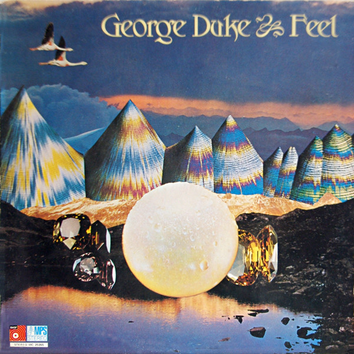

# Feel

By George Duke

## Album Data

[Discogs URL](https://www.discogs.com/release/1924523-George-Duke-Feel)

- Label: MPS Records
Delta (2)
- Formats: Vinyl, LP, Album, Reissue
- Genres: Jazz, Funk / Soul, Fusion, Jazz-Funk, Funk
- Rating: 4.57
- Released: 1977
- Year: 1974
- Release ID: 1924523
- Media condition: 
- Sleeve condition: 
- Speed: 
- Weight: 
- Notes: 

## Album Tracks

| **Position** | **Title** | **Duration** |
|--------------|-----------|--------------|
| A1 | **Funny Funk** | 5:18 |
| A2 | **Love** | 6:06 |
| A3 | **The Once Over** | 4:39 |
| A4 | **Feel** | 5:40 |
| B1 | **Cora Joberge** | 3:50 |
| B2 | **Old Slippers** | 5:41 |
| B3 | **Theme From The Opera "Tzina"** | 2:01 |
| B4 | **Yana Aminah** | 4:33 |
| B5 | **Rashid** | 3:36 |
| B6 | **Statement** | 1:15 |

## Artist Roles

| **Name** | **Role** |
|----------|----------|
| **John Heard** | Acoustic Bass, Electric Bass |
| **Sätty** | Design [Front Cover] |
| **Leon Ndugu Chancler** | Drums |
| **Obdewl'l X** | Guitar |
| **George Duke** | Keyboards |
| **Airto Moreira** | Percussion |
| **Leon Ndugu Chancler** | Percussion |
| **Baldhard G. Falk** | Photography By [Back Cover] |
| **Baldhard G. Falk** | Producer |
| **Kerry McNabb** | Recorded By, Mixed By |
| **George Duke** | Synthesizer [Bass] |
| **George Duke** | Vocals |
| **Flora Purim** | Vocals, Featuring |
| **George Duke** | Written-By |
| **Leon Ndugu Chancler** | Written-By |

