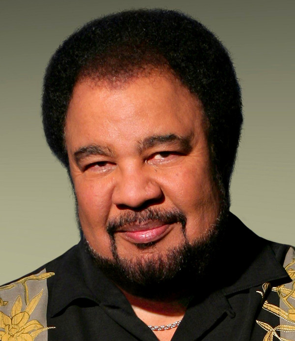

# George Duke

## Artist Profile

American R&B, soul, jazz and disco producer, keyboards player and composer.
Born on 12.01.1946 in San Rafael, CA, U.S.A. Died on 5th of August, 2013.
Cousin of Dianne Reeves.
He has a long, extensive solo discography as well as collaborations with Jean-Luc Ponty, Frank Zappa, Stanley Clarke, Billy Cobham, Cannonball Adderley, Deniece Williams, Jeffrey Osborne, George Clinton, Anita Baker, Regina Belle, Rachelle Ferrell, Marilyn Scott etc.

## Artist Links

- [https://www.georgeduke.com/](https://www.georgeduke.com/)
- [https://www.facebook.com/GeorgeDukeMusic](https://www.facebook.com/GeorgeDukeMusic)
- [https://en.wikipedia.org/wiki/George_Duke](https://en.wikipedia.org/wiki/George_Duke)
- [https://www.imdb.com/name/nm0241183/](https://www.imdb.com/name/nm0241183/)
- [https://www.thehistorymakers.org/biography/george-duke-41](https://www.thehistorymakers.org/biography/george-duke-41)

## See also

- [Feel](Feel.md)
- [Reach For It](Reach_For_It.md)
