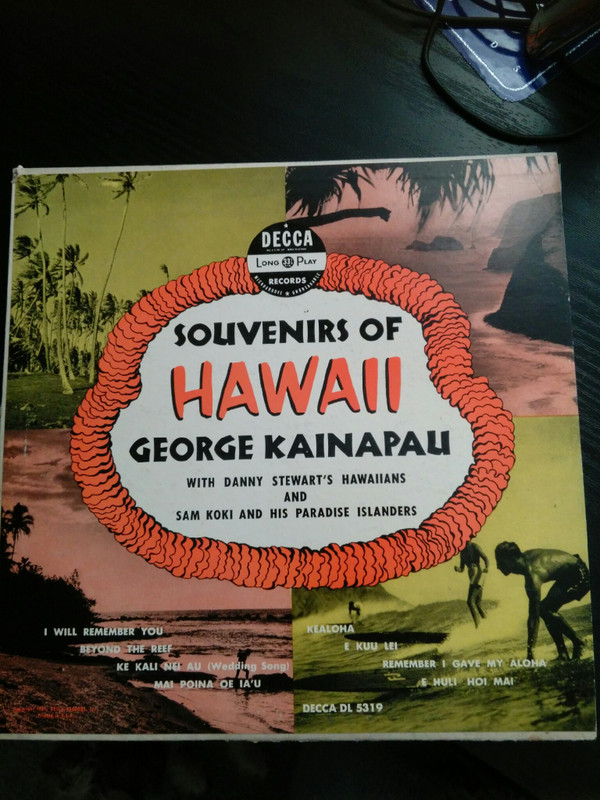

# Souvenirs Of Hawaii

By George Kainapau

## Album Data

[Discogs URL](https://www.discogs.com/release/7342818-George-Kainapau-With-Danny-Stewarts-Hawaiians-And-Sam-Koki-And-His-Paradise-Islanders-Souvenirs-Of-H)

- Label: Decca
- Formats: Vinyl, LP, 10", Album
- Genres: Folk, World, & Country, Hawaiian, Pacific
- Rating: 4.5
- Released: 1951
- Year: 1951
- Release ID: 7342818
- Media condition: 
- Sleeve condition: 
- Speed: 
- Weight: 
- Notes: 

## Album Tracks

| **Position** | **Title** | **Duration** |
|--------------|-----------|--------------|
| A1 | **I Will Remember You** |  |
| A2 | **Beyond The Reef** |  |
| A3 | **Ke Kali Nei Au - Wedding Song (Waiting For Thee)** |  |
| A4 | **Mai Poina Oe Ia'u (Forget Me Not)** |  |
| B1 | **Kealoha** |  |
| B2 | **E Kuu Lei** |  |
| B3 | **Remember I Gave My Aloha** |  |
| B4 | **E Huli Hoi Mai** |  |

