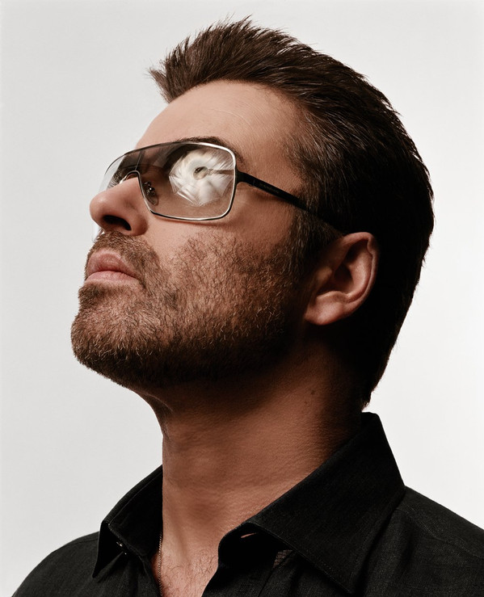

# George Michael

## Artist Profile

George Michael (born 25 June 1963, East Finchley, London, England - died 25 December 2016, Goring-on-Thames, Oxfordshire, England) was a British pop and soul singer, songwriter and producer.

He began his career as one half of the duo Wham! along with Andrew Ridgeley and went on to establish a solo career as a soul-influenced pop musician. His 1987 debut solo album, "Faith", became one of the best selling albums of all time, and also the first album to produce six top 5 singles in the United States and it has sold over 20 million copies worldwide. All four of his solo studio albums reached #1 on the U.K. charts and went on to become huge international successes. He has sold over 100 million records worldwide, encompassing 12 British #1 singles, 7 British #1 albums, 10 US #1 singles and 2 US #1 albums. He is one of the most played artists on British radio over the past two decades. Michael won numerous music awards throughout his 30-year career, including three Brit Awards (winning Best British Male twice), four MTV Video Music Awards, six Ivor Novello Awards (receiving Songwriter of the Year three times), three American Music Awards and two Grammy Awards (out of eight nominations).

## Artist Links

- [http://www.georgemichael.com](http://www.georgemichael.com)
- [http://www.georgemichael.org](http://www.georgemichael.org)
- [http://www.biography.com/musician/george-michael](http://www.biography.com/musician/george-michael)
- [http://www.darkshine.de](http://www.darkshine.de)
- [http://www.facebook.com/georgemichael](http://www.facebook.com/georgemichael)
- [http://www.facebook.com/GeorgeMichaelmylove](http://www.facebook.com/GeorgeMichaelmylove)
- [http://www.famousbirthdays.com/people/george-michael.html](http://www.famousbirthdays.com/people/george-michael.html)
- [http://www.geni.com/people/George-Michael/6000000015085691564](http://www.geni.com/people/George-Michael/6000000015085691564)
- [http://www.imdb.com/name/nm0584117](http://www.imdb.com/name/nm0584117)
- [http://www.instagram.com/georgemofficial](http://www.instagram.com/georgemofficial)
- [http://musicianbio.org/george-michael](http://musicianbio.org/george-michael)
- [http://www.musicianguide.com/biographies/1608004174/George-Michael.html](http://www.musicianguide.com/biographies/1608004174/George-Michael.html)
- [http://pinterest.com/georgemofficial](http://pinterest.com/georgemofficial)
- [http://twitter.com/georgemofficial](http://twitter.com/georgemofficial)
- [http://en.wikipedia.org/wiki/George_Michael](http://en.wikipedia.org/wiki/George_Michael)
- [http://www.yogworld.com](http://www.yogworld.com)
- [http://www.youtube.com/user/georgemichael](http://www.youtube.com/user/georgemichael)

## See also

- [Faith](Faith.md)
