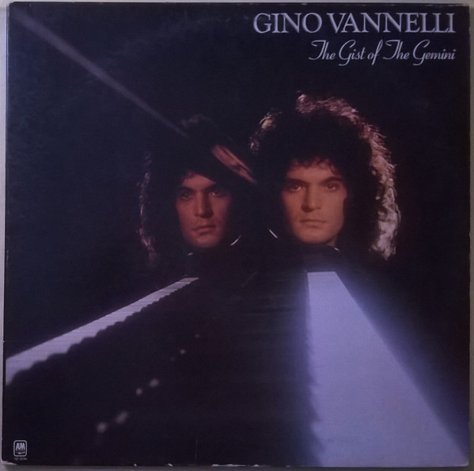

# The Gist Of The Gemini

By Gino Vannelli

## Album Data

[Discogs URL](https://www.discogs.com/release/1665028-Gino-Vannelli-The-Gist-Of-The-Gemini)

- Label: A&M Records
- Formats: Vinyl, LP, Album
- Genres: Jazz, Pop, Fusion, Jazz-Rock
- Rating: 3.81
- Released: null
- Year: 0
- Release ID: 1665028
- Media condition: 
- Sleeve condition: 
- Speed: 
- Weight: 
- Notes: 

## Album Tracks

| **Position** | **Title** | **Duration** |
|--------------|-----------|--------------|
| A1 | **Love Of My Life** | 4:30 |
| A2 | **Ugly Man** | 3:54 |
| A3 | **A New Fix For '76** | 3:32 |
| A4 | **Omens Of Love** | 4:31 |
| A5 | **Fly Into This Night** | 3:27 |
|  | **War Suite** |  |
| B1 | **Prelude To The War** | 4:32 |
| B2 | **The Battle Cry** | 1:52 |
| B3 | **To The War** | 4:34 |
| B4 | **Carnal Question** | 2:36 |
| B5 | **After The Last Battle** | 2:04 |
| B6 | **To The War (Reflection)** | 2:02 |
| B7 | **Summers Of My Life** | 4:28 |

## Artist Roles

| **Name** | **Role** |
|----------|----------|
| **Gino Vannelli** | Arranged By, Producer, Vocals |
| **Brenda Russell (2)** | Backing Vocals |
| **Dianne Brooks** | Backing Vocals |
| **Graham Lear** | Drums |
| **Jay Graydon** | Electric Guitar |
| **Jon Kelly** | Engineer [Assistent] |
| **Steve Prestage** | Engineer [Assistent] |
| **Norm Kinney** | Engineer [Re-mix] |
| **Geoff Emerick** | Engineer, Producer |
| **Ross Vannelli** | Guitar, Backing Vocals |
| **Richard Baker** | Organ, Synthesizer, Arranged By [Strings & Brass] |
| **Dido Morris** | Percussion |
| **John J. Mandel** | Percussion, Timpani |
| **Joe Vannelli** | Producer, Electric Piano, Grand Piano, Clavinet, Synthesizer, Arranged By [Strings & Brass] |
| **Gino Vannelli** | Written-By, Vocals |

