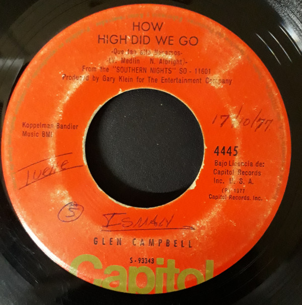

# Sunflower

By Glen Campbell

## Album Data

[Discogs URL](https://www.discogs.com/release/3063022-Glen-Campbell-Sunflower)

- Label: Capitol Records
- Formats: Vinyl, 7", Single, 45 RPM
- Genres: Folk, World, & Country, Country
- Rating: 4
- Released: 1977
- Year: 1977
- Release ID: 3063022
- Media condition: 
- Sleeve condition: 
- Speed: 
- Weight: 
- Notes: 

## Album Tracks

| **Position** | **Title** | **Duration** |
|--------------|-----------|--------------|
| A | **Sunflower** | 2:50 |
| B | **How High Did We Go** | 3:04 |

## Artist Roles

| **Name** | **Role** |
|----------|----------|
| **Gary Klein** | Producer [Produced By] |

