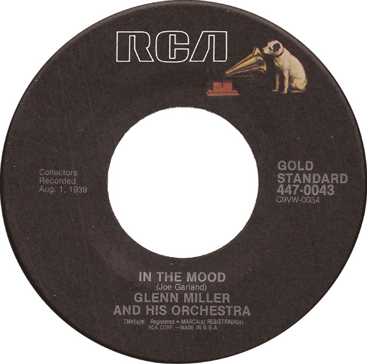

# In The Mood / A String Of Pearls

By Glenn Miller And His Orchestra

## Album Data

[Discogs URL](https://www.discogs.com/release/2416792-Glenn-Miller-And-His-Orchestra-In-The-Mood-A-String-Of-Pearls)

- Label: RCA
BMG
- Formats: Vinyl, 7", 45 RPM, Reissue
- Genres: Jazz, Big Band, Swing
- Rating: 3.11
- Released: 1989
- Year: 1951
- Release ID: 2416792
- Media condition: 
- Sleeve condition: 
- Speed: 
- Weight: 
- Notes: 

## Album Tracks

| **Position** | **Title** | **Duration** |
|--------------|-----------|--------------|
| A | **In The Mood** |  |
| AA | **A String Of Pearls** |  |

