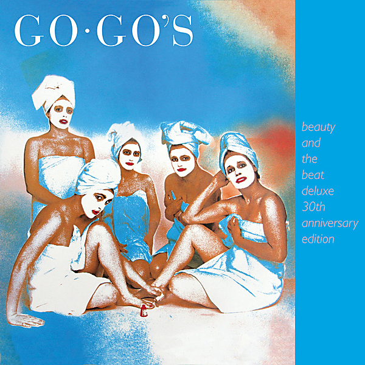

# Beauty And The Beat

By Go-Go's

## Album Data

[Discogs URL](https://www.discogs.com/release/395609-Go-Gos-Beauty-And-The-Beat)

- Label: I.R.S. Records
- Formats: Vinyl, LP, Album
- Genres: Rock, Pop Rock, New Wave
- Rating: 4.03
- Released: 1981
- Year: 1981
- Release ID: 395609
- Media condition: 
- Sleeve condition: 
- Speed: 
- Weight: 
- Notes: 

## Album Tracks

| **Position** | **Title** | **Duration** |
|--------------|-----------|--------------|
| A1 | **Our Lips Are Sealed** | 2:45 |
| A2 | **How Much More** | 3:03 |
| A3 | **Tonite** | 3:33 |
| A4 | **Lust To Love** | 4:00 |
| A5 | **This Town** | 3:15 |
| B1 | **We Got The Beat** | 2:36 |
| B2 | **Fading Fast** | 3:32 |
| B3 | **Automatic** | 2:34 |
| B4 | **You Can't Walk In Your Sleep (If You Can't Sleep)** | 3:00 |
| B5 | **Skidmarks On My Heart** | 3:13 |
| B6 | **Can't Stop The World** | 3:22 |

## Artist Roles

| **Name** | **Role** |
|----------|----------|
| **Ginger Canzoneri** | Art Direction |
| **Mike Doud (2)** | Art Direction |
| **Kathy Valentine** | Bass, Guitar |
| **Mike Fink** | Design |
| **Gina Schock** | Drums, Percussion |
| **Charlotte Caffey** | Lead Guitar, Vocals, Keyboards |
| **Belinda Carlisle** | Lead Vocals |
| **Ginger Canzoneri** | Management [Go-go's Management] |
| **Darroll Gustamachio** | Mixed By [Assistant] |
| **Eric Korte** | Mixed By [Assistant] |
| **Gray Russell** | Mixed By [Assistant] |
| **Go-Go's** | Music By [All Selections Written By] |
| **George DuBose** | Photography By |
| **Cindy Marsh (2)** | Photography By [Photo Illustration] |
| **Richard Gottehrer** | Producer |
| **Rob Freeman** | Producer, Recorded By, Mixed By |
| **James A. Ball** | Recorded By [Additional, Assistant] |
| **John Terelle** | Recorded By [Assistant] |
| **Ted Blechta** | Recorded By [Assistant] |
| **Jane Wiedlin** | Rhythm Guitar, Vocals |
| **Go-Go's** | Written-By [All Selections] |

