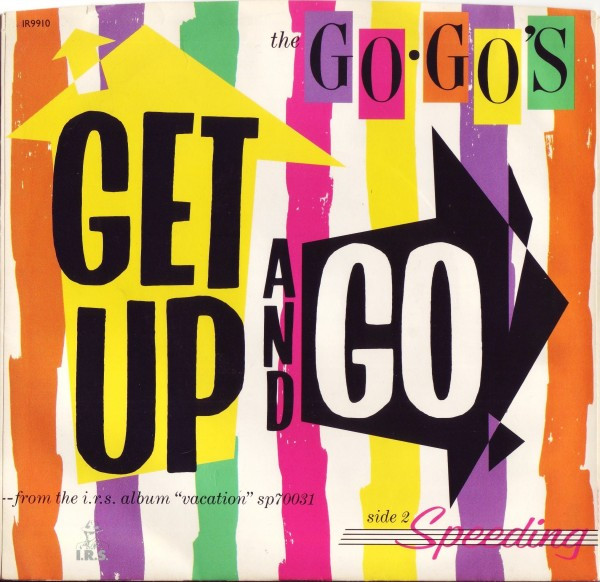

# Get Up And Go

By Go-Go's

## Album Data

[Discogs URL](https://www.discogs.com/release/3986342-The-GoGos-Get-Up-And-Go)

- Label: I.R.S. Records
I.R.S. Records
- Formats: Vinyl, 7", 45 RPM, Single, Promo, Stereo, Mono
- Genres: Rock, Pop, New Wave, Pop Rock
- Rating: 5
- Released: 1982
- Year: 1982
- Release ID: 3986342
- Media condition: 
- Sleeve condition: 
- Speed: 
- Weight: 
- Notes: 

## Album Tracks

| **Position** | **Title** | **Duration** |
|--------------|-----------|--------------|
| A | **Get Up And Go** | 3:12 |
| B | **Get Up And Go** | 3:12 |

## Artist Roles

| **Name** | **Role** |
|----------|----------|
| **Thom Panunzio** | Mixed By |
| **Richard Gottehrer** | Producer |
| **Thom Panunzio** | Recorded By |
| **Charlotte Caffey** | Written-By |
| **Jane Wiedlin** | Written-By |

