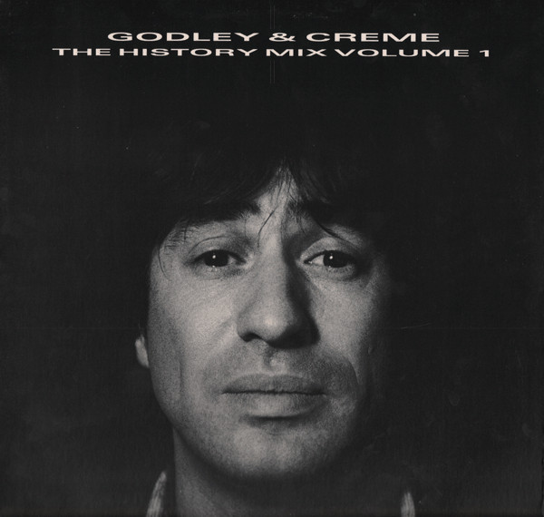

# The History Mix Volume 1

By Godley & Creme

## Album Data

[Discogs URL](https://www.discogs.com/release/2378054-Godley-Creme-The-History-Mix-Volume-1)

- Label: Polydor
Polydor
Polydor
- Formats: Vinyl, LP, Album
- Genres: Electronic, Rock, Pop, Synth-pop, Pop Rock, Soft Rock
- Rating: 3.57
- Released: 1985
- Year: 1985
- Release ID: 2378054
- Media condition: 
- Sleeve condition: 
- Speed: 
- Weight: 
- Notes: 

## Album Tracks

| **Position** | **Title** | **Duration** |
|--------------|-----------|--------------|
|  | **Wet Rubber Soup** |  |
| A2 | **Cry** |  |
| B1 | **Cry (Single Version)** | 3:55 |
| B2 | **Light Me Up** | 4:30 |
| B3 | **An Englishman In New York** | 5:52 |
| B4 | **Save A Mountain For Me** | 3:34 |
| B5 | **Golden Boy** | 5:46 |

## Artist Roles

| **Name** | **Role** |
|----------|----------|
| **Eric Stewart** | Producer, Performer |
| **Godley & Creme** | Producer, Performer |
| **Graham Gouldman** | Producer, Performer |
| **J.J. Jeczalik** | Producer, Performer |
| **Nigel Gray** | Producer, Performer |
| **Trevor Horn** | Producer, Performer |

