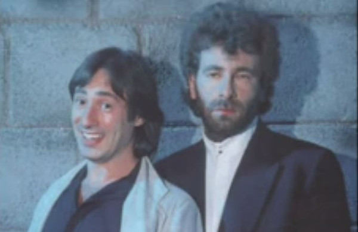

# Godley & Creme

## Artist Profile

Guitarist Lol Creme, and drummer Kevin Godley, both formerly members of smart-pop rockers 10cc. Striking out as a duo from 1977, they released the infamous triple album Consequences - a pseudo-musical with dialogue. They were also involved in video production and were responsible for Herbie Hancock's memorable "Rockit" video.

## Artist Links

- [http://gcworks.web.fc2.com/index.html](http://gcworks.web.fc2.com/index.html)
- [http://www.suppertime.co.uk/blint/](http://www.suppertime.co.uk/blint/)

## See also

- [The History Mix Volume 1](The_History_Mix_Volume_1.md)
